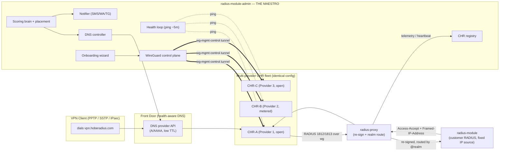

# HobeRadius CHR Fleet — Master Design Blueprint

> **Document set:** `docs/chr_fleet/` — `00`–`09`
> **Status:** Architecture / Planning deliverable (NOT code, NOT a prototype)
> **Audience:** implementation agents, the system owner, future maintainers
> **Branch:** `arch/chr-fleet-blueprint`

---

## 00 — Overview, Goals & Glossary

### 0.1 Executive summary

HobeRadius today is a **central RADIUS proxy** (`radius-proxy`) that receives
RADIUS Auth/Accounting from MikroTik CHR (Cloud Hosted Router) VPN gateways,
re-signs each packet (CHR secret → customer secret), routes it by `@realm` to
the correct customer RADIUS server, and re-signs the response back. A licensing
panel (`radius-module-admin`) already serves the proxy its routing table and
collects heartbeats; customer RADIUS instances run `radius-module`.

This blueprint extends that foundation into a **self-driving, multi-provider CHR
fleet** with three new capabilities, all orchestrated by the licensing panel
acting as the **maestro / control brain**:

1. **Smart, health-aware front door.** Customers always dial **one** domain
   (`vpn.hoberadius.com`). The panel keeps that name resolving **only to healthy
   CHRs**, across multiple hosting providers, via DNS-provider API automation.
   Works for PPTP, SSTP, and IPsec/IKEv2.

2. **Emergency failover + smart load balancing.** Every CHR is configured
   **identically**. RADIUS is the **sole source of each user's fixed private IP**
   (`Framed-IP-Address`) so a user keeps the same internal IP on any CHR
   ("roaming"). A scoring brain ranks CHRs by health, CPU, cost model, and free
   capacity, places new sessions on the best CHR, and rebalances/evacuates load.
   On a **provider outage**, every affected user is force-migrated; in normal
   operation, only users flagged `movable` are rebalanced.

3. **Auto-onboarding wizard.** The owner fills a short form (provider, capacity,
   speed, bandwidth, open/metered, overage, price/TB). The panel auto-generates a
   **WireGuard control tunnel** and a **single unified RouterOS script** — the
   same script for every CHR, with only the binding credentials differing — that
   stands up PPTP/SSTP/IPsec, the shared IP-pool policy, NAT, and masquerade.

The control plane between panel and each CHR runs over **WireGuard** (`wg-mgmt`),
already an invariant in the current deployment docs, carrying real-time commands
(query CPU/sessions, disconnect a user via CoA, move a user) — never data
traffic.

### 0.2 What "commercial-grade" means here

This is a design owner can hand to parallel implementation agents and to external
contractors. Every document is concrete: real DB schemas with column types, a
real scoring algorithm with numbers and hysteresis, real RouterOS config, real
DNS API call shapes, real Mermaid diagrams, and a phased plan with **explicit
per-task file ownership** so no two parallel agents edit the same file.

### 0.3 Goals (in priority order)

| # | Goal | Success measure |
|---|------|-----------------|
| G1 | **One address, always healthy.** | `vpn.hoberadius.com` never resolves to a CHR that has been DOWN for > 1 health window. |
| G2 | **No duplicate IPs, ever.** | A given `Framed-IP-Address` is live on at most one CHR at any instant (single-session + kill-old enforced). |
| G3 | **Automatic failover.** | A CHR DOWN ≥ ~5 min → its users redistributed automatically + owner notified, with no manual action. |
| G4 | **Cost-aware balancing.** | Unlimited/open providers fill first; metered providers drained as they approach cap; owner spend minimized at equal health. |
| G5 | **One-click onboarding.** | A new CHR goes from "form submitted" to "serving traffic + monitored" with zero hand-written RouterOS config. |
| G6 | **Honest interruption budget.** | A CHR dying mid-session reconnects to the **same IP** via the front door within **seconds** (near-transparent), and this limit is documented, not hidden. |

### 0.4 Explicit non-goals

- **Zero-interruption live tunnel migration.** A stateful PPTP/SSTP/IPsec tunnel
  cannot teleport between hosts; see [01](01_ARCHITECTURE.md) §"Physical limits"
  and [05](05_LOAD_BALANCER_BRAIN.md). Best achievable = fast reconnect.
- **Replacing the customer's RADIUS.** `radius-module` remains the auth source of
  truth for customer credentials; the fleet brain never authenticates users.
- **Editing `radius-module` / `radius-module-admin` in this branch.** They are
  referenced by path/contract only; this branch only writes docs.
- **Geo-routing / latency-based steering** in v1 (listed as a future option in
  [03](03_FRONT_DOOR_DNS.md)).

### 0.5 The three repositories

| Repo | Role in the fleet | Touched by this blueprint |
|------|-------------------|---------------------------|
| **`radius-proxy`** | Central RADIUS UDP proxy. Front-door **data-path health probe target** and the component that emits **per-realm/per-CHR RADIUS telemetry** (accept/reject/acct counters) the brain consumes. Likely home of the lightweight **CoA/Disconnect sender** for kill-old-session. | Read to ground design; new modules specified, implemented in later phases. |
| **`radius-module-admin`** (the panel) | **The maestro.** CHR registry, monitoring/health loop, scoring brain, onboarding wizard, DNS automation, WireGuard control plane, notifications (SMS/WhatsApp/Telegram), and owner-facing UI. Owns nearly all new tables. | Referenced by path/contract; owns most new work. |
| **`radius-module`** | Customer-side RADIUS (FreeRADIUS-compatible). Authenticates users and is the **source of `Framed-IP-Address`** (the fixed private IP). Must reply with a deterministic IP per user and accept CoA/Disconnect. | Referenced by contract; small attribute/CoA requirements documented. |

### 0.6 The agreed design in one diagram

### 0.7 Glossary

| Term | Definition |
|------|------------|
| **CHR** | MikroTik Cloud Hosted Router — a RouterOS VM at a hosting provider acting as a VPN gateway (PPTP/SSTP/IPsec server). |
| **Fleet** | All CHRs across all providers, managed as one pool by the panel. |
| **Maestro / Brain** | The orchestration logic inside `radius-module-admin`: registry + health + scoring + DNS + control plane + notifications. |
| **Front door** | The single public DNS name (`vpn.hoberadius.com`) customers dial; kept pointing at healthy CHRs only. |
| **Provider** | A hosting company supplying one or more CHRs, each with its own cost model (open/unlimited vs metered $/TB) and caps. |
| **Open / unlimited provider** | Flat-rate or unmetered bandwidth — preferred for fill. |
| **Metered provider** | Charges per GB/TB; has a monthly cap; penalized in scoring as usage nears the cap. |
| **Fixed private IP** | The per-user internal IP delivered by RADIUS via `Framed-IP-Address` (RADIUS attr 8). Constant for a user across all CHRs. |
| **Roaming** | A user reconnecting to a different CHR and getting the **same** fixed private IP, because RADIUS — not any CHR pool — assigns it. |
| **Single-session enforcement** | Guarantee that a user has at most one active session fleet-wide, so the fixed IP is never live twice. |
| **CoA / Disconnect** | RADIUS Change-of-Authorization / Disconnect-Message (RFC 3576/5176) — used to kill an old session ("kill-old-session") and to force-move a user. |
| **`movable` flag** | Per-user opt-in (per owner↔customer agreement) permitting load-balance moves during normal operation. Ignored (overridden) during a forced outage failover. |
| **Forced failover** | Mandatory migration of **all** affected users when a CHR/provider goes DOWN, regardless of `movable`. |
| **`wg-mgmt`** | The WireGuard control tunnel between panel and each CHR. Carries commands/telemetry only — **never** customer data traffic. |
| **Scoring brain** | The ranking algorithm that picks the best CHR for placement/rebalancing ([05](05_LOAD_BALANCER_BRAIN.md)). |
| **Hysteresis / cooldown** | Threshold gap + minimum dwell time preventing rapid flip-flopping ("flapping") of health state and rebalancing decisions. |
| **Thundering herd** | The load spike when many users from a failed CHR reconnect at once; mitigated by capacity headroom + staggered reconnect. |
| **Realm** | The `@suffix` of a RADIUS `User-Name`; maps a user to a customer's RADIUS route in the proxy. |
| **TTL** | DNS time-to-live; low TTL on the front-door record bounds failover time. |

### 0.8 How to read this set

| Read this if you want… | Go to |
|------------------------|-------|
| The component map + contracts + master diagram | [01_ARCHITECTURE.md](01_ARCHITECTURE.md) |
| Exact DB tables and which repo owns them | [02_DATA_MODEL.md](02_DATA_MODEL.md) |
| The smart-DNS mechanism | [03_FRONT_DOOR_DNS.md](03_FRONT_DOOR_DNS.md) |
| Fixed IP + single-session + CoA | [04_FIXED_IP_AND_SESSIONS.md](04_FIXED_IP_AND_SESSIONS.md) |
| The scoring algorithm with numbers | [05_LOAD_BALANCER_BRAIN.md](05_LOAD_BALANCER_BRAIN.md) |
| The onboarding wizard + RouterOS template | [06_ONBOARDING_WIZARD.md](06_ONBOARDING_WIZARD.md) |
| The WireGuard control channel + API | [07_CONTROL_PLANE.md](07_CONTROL_PLANE.md) |
| The phased build plan + file ownership | [08_PHASED_PLAN.md](08_PHASED_PLAN.md) |
| What the owner must provide + risks | [09_OWNER_INPUTS_AND_RISKS.md](09_OWNER_INPUTS_AND_RISKS.md) |
