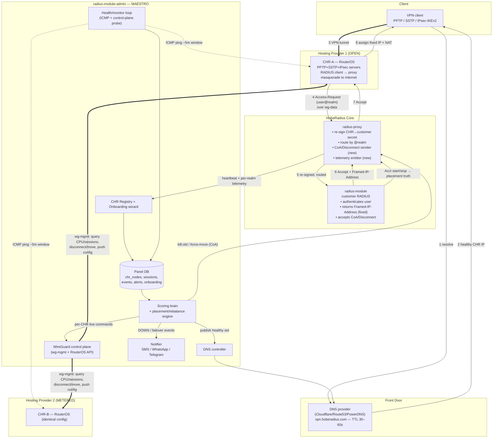
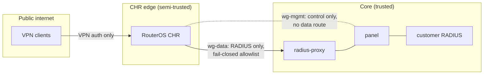

# 01 — System Architecture

> Component architecture across the three repositories, the end-to-end
> data/control flow, the responsibilities of each component, and the
> contracts (interfaces) between them.

---

## 1.1 Layered view

The fleet is built in four planes. Keeping them separate is the core
architectural decision: the **data plane** must keep working even if the
**control plane** is temporarily unreachable (fail-safe), and the **brain** must
never sit in the synchronous auth path.

| Plane | What flows | Components | Failure posture |
|-------|-----------|------------|-----------------|
| **Front-door plane** | DNS resolution of `vpn.hoberadius.com` | DNS provider + panel DNS controller | If panel is down, the last-published record set stays live (DNS keeps serving). |
| **Data plane** | VPN tunnels + RADIUS Auth/Acct | Client → CHR → `radius-proxy` → `radius-module` | Must work without the brain. Proxy already fails *closed* on unknown CHRs. |
| **Control plane** | Commands + telemetry | Panel `wg-mgmt` ↔ CHR RouterOS API; proxy heartbeat/telemetry → panel | If down, data plane keeps serving stale-but-valid state; no new placement/rebalance until restored. |
| **Brain plane** | Scoring, placement, failover decisions | Panel scheduler + scoring engine + DNS/CoA actuators | Purely asynchronous. A crash delays optimization, never breaks live sessions. |

---

## 1.2 Master data + control flow diagram



**Numbered data path (steps 1–8)** is the synchronous customer experience. The
dotted/double lines are asynchronous control. The brain reads `DB` and actuates
through three actuators only: **DNS controller** (front door), **proxy CoA
sender** (sessions), and **WireGuard control plane** (per-CHR commands).

---

## 1.3 Component responsibilities & ownership

### 1.3.1 `radius-proxy` (this repo)

Existing (grounded in current code):

- UDP listeners on 1812/1813 (`proxy.py:RadiusProxyProtocol`).
- Re-sign CHR secret → customer secret and back (`radius_packet.replace_secret_in_packet`, `rebuild_response`).
- Realm extraction + routing (`radius_packet.realm`, `routing_table.RoutingTable.lookup`).
- CHR allowlist (fail-closed) (`routing_table.is_allowed_chr`).
- Periodic routing-table pull + heartbeat to panel (`routing_table.refresh/heartbeat`).

New modules added in later phases (specified here, not implemented in this branch):

| New module (proposed path) | Responsibility | Phase |
|---|---|---|
| `coa.py` | Build + send RADIUS Disconnect-Request / CoA-Request (RFC 5176) to a CHR's CoA port (3799) to kill or move a session. | P7 |
| `telemetry.py` | Aggregate per-realm **and per-CHR** counters (accepts/rejects/acct-start/stop, last-seen) and POST to a new panel endpoint. | P4 |
| `placement_hook.py` | On Accounting-Start, report `(user, realm, chr_ip, framed_ip, acct_session_id)` to the panel so the panel's `sessions` table reflects *ground truth* (which CHR a user is actually on). | P4 |

> The proxy is the natural CoA origin because it already holds the customer
> secret per realm and sits on the `wg` network with line-of-sight to CHRs.

### 1.3.2 `radius-module-admin` (the panel — maestro)

| Subsystem | Responsibility | Doc |
|---|---|---|
| **CHR Registry** | CRUD of CHR nodes, providers, cost models, caps, capacity, weights. | [02](02_DATA_MODEL.md) |
| **Onboarding wizard** | Form → WireGuard keypair + unified RouterOS script → push via control plane → verify. | [06](06_ONBOARDING_WIZARD.md) |
| **Health/monitor loop** | ICMP ping each CHR; control-plane liveness; compute UP/DEGRADED/DOWN with hysteresis. | [05](05_LOAD_BALANCER_BRAIN.md) |
| **Scoring brain** | Rank CHRs; pick placement target; decide rebalance/evacuate moves. | [05](05_LOAD_BALANCER_BRAIN.md) |
| **DNS controller** | Publish the healthy CHR set into `vpn.hoberadius.com`. | [03](03_FRONT_DOOR_DNS.md) |
| **WireGuard control plane** | Maintain `wg-mgmt` to each CHR; issue RouterOS API commands (query CPU/sessions, disconnect, move, push config). | [07](07_CONTROL_PLANE.md) |
| **Notifier** | Owner alerts on DOWN/failover/cap-breach via SMS/WhatsApp/Telegram (messaging layer already being built here). | [02](02_DATA_MODEL.md), [05](05_LOAD_BALANCER_BRAIN.md) |
| **Routing-table API** | Existing `/api/proxy/*` endpoints the proxy already consumes. Extended with telemetry + placement ingest. | §1.4 |

### 1.3.3 `radius-module` (customer RADIUS)

Contract requirements (no edits in this branch — documented for the customer side):

1. **Deterministic fixed IP.** For a given username, always return the **same**
   `Framed-IP-Address` (attr 8) in Access-Accept. The IP comes from a per-customer
   plan/DB mapping — **never** from a CHR-local pool. See [04](04_FIXED_IP_AND_SESSIONS.md).
2. **Accept CoA/Disconnect** (RFC 5176) so the proxy/panel can kill the old session.
3. **Optionally** include session-limit attributes; single-session is primarily
   enforced fleet-side (panel + CoA) because users span multiple CHRs.

---

## 1.4 Interfaces & contracts

### 1.4.1 Existing proxy ↔ panel contracts (must not break)

Grounded in `routing_table.py` and `config.py`:

**Auth header (all proxy→panel calls):**
```
X-Proxy-Token: <ts>:<nonce>:<HMAC-SHA256(secret, "ts:nonce")>
```
where `secret = RADIUS_PROXY_SHARED_SECRET`. Replay window must be enforced
panel-side (recommend ±300s + nonce cache).

**`GET /api/proxy/routing-table`** →
```json
{
  "ok": true,
  "routes": [
    {"realm":"client5","customer_id":42,"target_ip":"10.20.0.5",
     "auth_port":1812,"acct_port":1813,"secret":"<customer-secret>",
     "allowed_chr_ips":["10.10.0.11","10.10.0.12"]}
  ],
  "chr_nodes": [{"public_ip":"203.0.113.11"}]
}
```

**`POST /api/proxy/heartbeat`** ← proxy stats (proxy_id, uptime, request counters,
active_realms, realms_not_found). Already implemented.

### 1.4.2 New contracts introduced by the fleet (specified, built in later phases)

| Contract | Direction | Purpose | Phase |
|---|---|---|---|
| `POST /api/proxy/telemetry` | proxy → panel | Per-CHR + per-realm counters, last-seen, accept/reject/acct rates. Feeds health + scoring. | P4 |
| `POST /api/proxy/placement` | proxy → panel | On Acct-Start/Stop: `(username, realm, chr_public_ip, framed_ip, acct_session_id, event)`. Ground-truth session→CHR mapping. | P4 |
| `POST /api/proxy/coa` | panel → proxy | Ask proxy to send Disconnect/CoA for a `(realm, acct_session_id|username, chr_ip)`. | P7 |
| `GET /api/fleet/chr/{id}/metrics` (internal) | panel ↔ CHR via `wg-mgmt` | RouterOS API: CPU, active PPP/IPsec sessions, interface bytes. | P4/P7 |
| `POST /api/fleet/chr/{id}/command` (internal) | panel → CHR | disconnect-user, move-user, push-config, reload. | P7 |
| DNS provider API | panel → DNS | Upsert A/AAAA records for `vpn.hoberadius.com`. | P6 |
| Notifier API | panel → SMS/WA/TG gateways | Owner alerts. | P9 |

All contracts use the same HMAC-token discipline as the existing `/api/proxy/*`
endpoints; control-plane CHR commands additionally ride inside `wg-mgmt`
(network-level isolation) — see [07](07_CONTROL_PLANE.md).

---

## 1.5 Trust & security boundaries



**Invariants (carried from current deployment doc + extended):**

- RADIUS ports (1812/1813) and CoA (3799) are reachable **only** over WireGuard,
  never the public internet.
- `wg-mgmt` carries control/telemetry only — **no NAT, no default route, no
  forwarding** (existing invariant). Onboarding scripts must preserve this.
- Customer RADIUS secrets and WireGuard private keys are never logged or returned
  to client apps (existing invariant; extends to onboarding-generated keys).
- CHRs never learn customer RADIUS IPs — only the proxy address (existing).
- The brain's only write paths to the live world are the three actuators (DNS,
  CoA, control-plane); every actuation is recorded in `events` for audit.

---

## 1.6 Why these technology choices

| Decision | Rationale | Alternative rejected |
|---|---|---|
| RADIUS as sole IP source | Guarantees one IP per user fleet-wide; enables roaming + dedupe. | CHR-local pools → duplicate IPs across CHRs. |
| Health-aware DNS as the front door | Works uniformly for PPTP/SSTP/IPsec (all dial a name); no client-side agent. | Anycast/BGP — needs owned IP space + provider BGP; out of scope. |
| WireGuard control plane | Already an invariant; encrypted, NAT-traversing, cheap on RouterOS. | Public RouterOS API/SSH — large attack surface. |
| CoA for kill-old/move | RFC-standard, supported by RouterOS + FreeRADIUS; no custom protocol. | Polling + reconfig — slow, racy. |
| Brain async/out-of-path | Keeps auth latency flat; brain can crash without dropping sessions. | In-path decision — adds latency + a hard dependency. |

Continue to **[02_DATA_MODEL.md](02_DATA_MODEL.md)** for the concrete schema.
