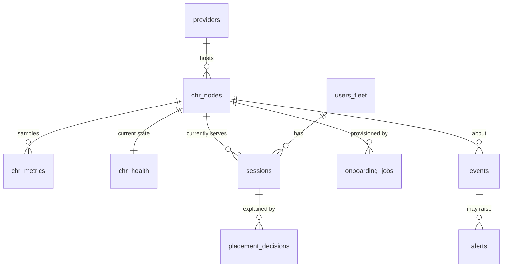

# 02 — Data Model

> Concrete relational schema for the fleet. Types are shown in PostgreSQL
> dialect (the panel's database); adapt to MySQL/MariaDB if `radius-module-admin`
> uses it — column semantics are identical. Each table notes **which repo owns
> it** (owns = is the source of truth and runs the migration).

---

## 2.1 Ownership map

| Table | Owner repo | Source of truth for |
|-------|-----------|---------------------|
| `providers` | `radius-module-admin` | Hosting companies + cost model |
| `chr_nodes` | `radius-module-admin` | Each CHR: identity, caps, weights, status |
| `chr_metrics` | `radius-module-admin` | Time-series live metrics (CPU, sessions, bytes) |
| `chr_health` | `radius-module-admin` | Rolling health state + flap control |
| `onboarding_jobs` | `radius-module-admin` | Wizard runs + generated artifacts |
| `users_fleet` *(view/ext)* | `radius-module-admin` | Per-user `movable` flag + fixed IP mapping |
| `sessions` | `radius-module-admin` | Ground-truth session→CHR placement |
| `placement_decisions` | `radius-module-admin` | Brain's chosen target + reason (audit) |
| `events` | `radius-module-admin` | Health/failover/move/onboarding event log |
| `alerts` | `radius-module-admin` | Owner notifications + delivery status |
| `dns_records_state` | `radius-module-admin` | Last-published front-door record set |
| `fixed_ip_pool` | `radius-module` *(contract)* | Authoritative user→`Framed-IP` map (panel mirrors read-only) |

> **Rule:** `radius-module` owns the *authoritative* user→fixed-IP mapping
> (it's what RADIUS hands out). The panel keeps a **read-only mirror** for
> dedupe/visibility. The panel owns everything operational about the fleet.



---

## 2.2 `providers`

```sql
CREATE TABLE providers (
  id              BIGSERIAL PRIMARY KEY,
  name            TEXT        NOT NULL UNIQUE,          -- "Contabo", "Hetzner"...
  cost_model      TEXT        NOT NULL                  -- 'open' | 'metered'
                  CHECK (cost_model IN ('open','metered')),
  price_per_tb    NUMERIC(10,2) DEFAULT 0,              -- USD per TB (metered only)
  monthly_cap_tb  NUMERIC(12,3),                        -- NULL = unlimited (open)
  overage_allowed BOOLEAN     NOT NULL DEFAULT FALSE,   -- may exceed cap (paid)?
  overage_price_per_tb NUMERIC(10,2),                   -- price beyond cap
  billing_cycle_day SMALLINT  NOT NULL DEFAULT 1,       -- day-of-month cap resets
  api_creds_ref   TEXT,                                 -- vault key for provider API (optional)
  created_at      TIMESTAMPTZ NOT NULL DEFAULT now(),
  updated_at      TIMESTAMPTZ NOT NULL DEFAULT now()
);
```

`cost_model`/`price_per_tb`/`monthly_cap_tb` drive the cost penalty in the
scoring brain ([05](05_LOAD_BALANCER_BRAIN.md) §5.3).

---

## 2.3 `chr_nodes` — the heart of the registry

```sql
CREATE TABLE chr_nodes (
  id                BIGSERIAL PRIMARY KEY,
  provider_id       BIGINT NOT NULL REFERENCES providers(id),
  name              TEXT   NOT NULL,                    -- owner-given label
  -- ── network identity ──────────────────────────────────────────────
  public_ip         INET   NOT NULL UNIQUE,             -- front-door candidate + RADIUS source
  public_ipv6       INET,                               -- optional AAAA candidate
  wg_mgmt_ip        INET   NOT NULL UNIQUE,             -- control-plane address (e.g. 10.99.0.X)
  wg_mgmt_pubkey    TEXT   NOT NULL,                    -- CHR side WireGuard public key
  routeros_api_port INT    NOT NULL DEFAULT 8729,       -- api-ssl over wg-mgmt
  coa_port          INT    NOT NULL DEFAULT 3799,
  -- ── declared capacity (from onboarding wizard) ────────────────────
  max_sessions      INT    NOT NULL,                    -- declared hard cap
  link_speed_mbps   INT    NOT NULL,                    -- uplink speed
  bandwidth_cap_tb  NUMERIC(12,3),                      -- per-node cap (NULL = inherit provider)
  cost_model        TEXT   NOT NULL DEFAULT 'inherit'   -- 'inherit'|'open'|'metered'
                    CHECK (cost_model IN ('inherit','open','metered')),
  price_per_tb      NUMERIC(10,2),                      -- override provider price
  overage_allowed   BOOLEAN,                            -- override provider flag
  -- ── operator-tunable weights / weighting ──────────────────────────
  weight            NUMERIC(5,2) NOT NULL DEFAULT 1.0,  -- manual preference multiplier
  enabled           BOOLEAN NOT NULL DEFAULT TRUE,      -- admin on/off (drains, not deletes)
  drain             BOOLEAN NOT NULL DEFAULT FALSE,     -- accept no new sessions, keep current
  -- ── live denormalized snapshot (updated by metrics loop) ──────────
  status            TEXT   NOT NULL DEFAULT 'provisioning'
                    CHECK (status IN ('provisioning','up','degraded','down','disabled')),
  cpu_pct           NUMERIC(5,2),                       -- latest CPU %
  active_sessions   INT    DEFAULT 0,
  used_tb_cycle     NUMERIC(12,3) DEFAULT 0,            -- bandwidth used this billing cycle
  score             NUMERIC(8,3),                       -- latest brain score (denormalized)
  last_seen_at      TIMESTAMPTZ,                        -- last successful control-plane contact
  last_ping_ok_at   TIMESTAMPTZ,                        -- last successful ICMP
  -- ── audit ─────────────────────────────────────────────────────────
  created_at        TIMESTAMPTZ NOT NULL DEFAULT now(),
  updated_at        TIMESTAMPTZ NOT NULL DEFAULT now(),
  UNIQUE (provider_id, name)
);
CREATE INDEX idx_chr_status      ON chr_nodes (status) WHERE enabled;
CREATE INDEX idx_chr_score       ON chr_nodes (score DESC) WHERE status = 'up';
```

**Effective cost / cap resolution:** when `chr_nodes.cost_model='inherit'`, use
`providers.*`; otherwise the node override wins. A helper view exposes the
resolved values to the brain:

```sql
CREATE VIEW chr_effective AS
SELECT n.*,
  COALESCE(NULLIF(n.cost_model,'inherit'), p.cost_model)       AS eff_cost_model,
  COALESCE(n.price_per_tb,  p.price_per_tb)                    AS eff_price_per_tb,
  COALESCE(n.bandwidth_cap_tb, p.monthly_cap_tb)              AS eff_cap_tb,
  COALESCE(n.overage_allowed, p.overage_allowed)             AS eff_overage_allowed
FROM chr_nodes n JOIN providers p ON p.id = n.provider_id;
```

---

## 2.4 `chr_metrics` — time series

```sql
CREATE TABLE chr_metrics (
  id            BIGSERIAL PRIMARY KEY,
  chr_id        BIGINT NOT NULL REFERENCES chr_nodes(id) ON DELETE CASCADE,
  ts            TIMESTAMPTZ NOT NULL DEFAULT now(),
  cpu_pct       NUMERIC(5,2),
  mem_pct       NUMERIC(5,2),
  active_sessions INT,
  rx_bytes      BIGINT,                                 -- cumulative interface counters
  tx_bytes      BIGINT,
  ping_rtt_ms   NUMERIC(7,2),
  ping_loss_pct NUMERIC(5,2),
  source        TEXT NOT NULL DEFAULT 'control'         -- 'control'|'ping'|'proxy'
);
SELECT create_hypertable('chr_metrics','ts', if_not_exists => TRUE); -- if TimescaleDB
CREATE INDEX idx_metrics_chr_ts ON chr_metrics (chr_id, ts DESC);
-- Retention: keep raw 14d, downsample to hourly beyond (job, P9).
```

`used_tb_cycle` in `chr_nodes` is derived by diffing `rx_bytes+tx_bytes` over the
billing cycle (handling counter resets on reboot — see [05](05_LOAD_BALANCER_BRAIN.md) §5.3).

---

## 2.5 `chr_health` — rolling state + flap control

```sql
CREATE TABLE chr_health (
  chr_id            BIGINT PRIMARY KEY REFERENCES chr_nodes(id) ON DELETE CASCADE,
  state             TEXT NOT NULL DEFAULT 'unknown'
                    CHECK (state IN ('unknown','up','degraded','down')),
  consecutive_fail  INT  NOT NULL DEFAULT 0,            -- failed probe windows in a row
  consecutive_ok    INT  NOT NULL DEFAULT 0,
  first_fail_at     TIMESTAMPTZ,                        -- when current down-streak began
  state_since       TIMESTAMPTZ NOT NULL DEFAULT now(), -- for cooldown/hysteresis
  last_transition   TEXT,                               -- 'up->down' etc.
  flap_count_1h     INT NOT NULL DEFAULT 0              -- transitions in last hour (dampening)
);
```

Hysteresis lives here: a node only flips UP→DOWN after `consecutive_fail`
crosses the down threshold AND `state_since` respects the cooldown — see
[05](05_LOAD_BALANCER_BRAIN.md) §5.5.

---

## 2.6 `users_fleet` — per-user movable flag + fixed IP mirror

The customer's users live in `radius-module`. The panel keeps a fleet-facing
record keyed by the RADIUS identity (`username` incl. realm):

```sql
CREATE TABLE users_fleet (
  id            BIGSERIAL PRIMARY KEY,
  customer_id   BIGINT NOT NULL,                        -- maps to existing customer
  realm         TEXT   NOT NULL,
  username      TEXT   NOT NULL,                        -- full user@realm (lowercased)
  movable       BOOLEAN NOT NULL DEFAULT FALSE,         -- opt-in per owner↔customer agreement
  fixed_ip      INET,                                   -- mirror of Framed-IP-Address (read-only)
  pinned_chr_id BIGINT REFERENCES chr_nodes(id),        -- optional sticky preference
  created_at    TIMESTAMPTZ NOT NULL DEFAULT now(),
  updated_at    TIMESTAMPTZ NOT NULL DEFAULT now(),
  UNIQUE (username)
);
CREATE INDEX idx_users_movable ON users_fleet (movable) WHERE movable;
```

> `movable` governs **normal-operation rebalancing only**. During a **forced
> failover** the brain ignores it (see [05](05_LOAD_BALANCER_BRAIN.md) §5.6).

---

## 2.7 `sessions` — ground-truth placement

Populated from proxy `POST /api/proxy/placement` (Acct-Start/Stop) — this is the
authoritative "which CHR is this user actually on" table, and the dedupe guard.

```sql
CREATE TABLE sessions (
  id              BIGSERIAL PRIMARY KEY,
  username        TEXT   NOT NULL,
  realm           TEXT   NOT NULL,
  chr_id          BIGINT NOT NULL REFERENCES chr_nodes(id),
  framed_ip       INET   NOT NULL,                      -- the fixed IP in use
  acct_session_id TEXT   NOT NULL,                      -- RADIUS Acct-Session-Id
  nas_ip          INET,                                 -- CHR public/identifier
  state           TEXT   NOT NULL DEFAULT 'active'
                  CHECK (state IN ('active','closing','closed')),
  started_at      TIMESTAMPTZ NOT NULL DEFAULT now(),
  last_acct_at    TIMESTAMPTZ,
  closed_at       TIMESTAMPTZ,
  bytes_in        BIGINT DEFAULT 0,
  bytes_out       BIGINT DEFAULT 0
);
-- Dedupe guard: at most ONE active session per username fleet-wide.
CREATE UNIQUE INDEX uq_active_session_per_user
  ON sessions (username) WHERE state = 'active';
-- Safety: a fixed IP must not be active twice (defense-in-depth vs G2).
CREATE UNIQUE INDEX uq_active_ip
  ON sessions (framed_ip) WHERE state = 'active';
CREATE INDEX idx_sessions_chr ON sessions (chr_id) WHERE state = 'active';
```

The two partial-unique indexes are the database-level enforcement of goal **G2**
(no duplicate IP) and single-session. The application layer + CoA close the old
row before/while inserting the new one (see [04](04_FIXED_IP_AND_SESSIONS.md) §4.4).

---

## 2.8 `placement_decisions` — brain audit

```sql
CREATE TABLE placement_decisions (
  id            BIGSERIAL PRIMARY KEY,
  username      TEXT NOT NULL,
  decided_at    TIMESTAMPTZ NOT NULL DEFAULT now(),
  kind          TEXT NOT NULL                            -- 'new'|'rebalance'|'forced_failover'|'manual'
                CHECK (kind IN ('new','rebalance','forced_failover','manual')),
  from_chr_id   BIGINT REFERENCES chr_nodes(id),
  to_chr_id     BIGINT REFERENCES chr_nodes(id),
  reason        JSONB NOT NULL,                          -- score breakdown snapshot
  outcome       TEXT NOT NULL DEFAULT 'pending'          -- 'pending'|'applied'|'failed'|'skipped'
);
CREATE INDEX idx_pd_user ON placement_decisions (username, decided_at DESC);
```

`reason` stores the full per-factor score breakdown so every move is explainable
("moved off CHR-B because cost_penalty 0.7 + cpu 82%").

---

## 2.9 `events` and `alerts`

```sql
CREATE TABLE events (
  id          BIGSERIAL PRIMARY KEY,
  ts          TIMESTAMPTZ NOT NULL DEFAULT now(),
  chr_id      BIGINT REFERENCES chr_nodes(id),
  kind        TEXT NOT NULL,    -- 'health_down','health_up','failover_start','failover_done',
                                -- 'cap_warn','cap_breach','onboard_ok','onboard_fail','dns_update',
                                -- 'coa_sent','move_ok','move_fail','flap_suppressed'
  severity    TEXT NOT NULL DEFAULT 'info'
              CHECK (severity IN ('info','warn','crit')),
  detail      JSONB NOT NULL DEFAULT '{}'
);
CREATE INDEX idx_events_chr_ts ON events (chr_id, ts DESC);
CREATE INDEX idx_events_kind   ON events (kind, ts DESC);

CREATE TABLE alerts (
  id           BIGSERIAL PRIMARY KEY,
  event_id     BIGINT REFERENCES events(id),
  created_at   TIMESTAMPTZ NOT NULL DEFAULT now(),
  channel      TEXT NOT NULL,   -- 'sms'|'whatsapp'|'telegram'
  recipient    TEXT NOT NULL,
  body         TEXT NOT NULL,
  status       TEXT NOT NULL DEFAULT 'queued'
               CHECK (status IN ('queued','sent','failed','suppressed')),
  sent_at      TIMESTAMPTZ,
  dedupe_key   TEXT,            -- collapse storms: e.g. 'chr:7:down' within window
  retries      INT NOT NULL DEFAULT 0
);
CREATE UNIQUE INDEX uq_alert_dedupe
  ON alerts (dedupe_key) WHERE status IN ('queued','sent');
```

`dedupe_key` + the partial unique index implement alert-storm suppression (one
"CHR-7 down" message, not 50). The notifier (built in `radius-module-admin`'s
messaging layer) consumes `alerts` rows.

---

## 2.10 `onboarding_jobs`

```sql
CREATE TABLE onboarding_jobs (
  id            BIGSERIAL PRIMARY KEY,
  chr_id        BIGINT REFERENCES chr_nodes(id),         -- set once node row created
  status        TEXT NOT NULL DEFAULT 'draft'            -- see state machine in 06
                CHECK (status IN ('draft','keys_generated','script_generated',
                                  'pushed','verifying','active','failed')),
  form_input    JSONB NOT NULL,                          -- raw wizard fields
  wg_keypair_ref TEXT,                                   -- vault ref (private key NEVER in DB plaintext)
  generated_script_ref TEXT,                             -- artifact store ref
  verify_report JSONB,                                   -- health/probe results post-push
  created_at    TIMESTAMPTZ NOT NULL DEFAULT now(),
  updated_at    TIMESTAMPTZ NOT NULL DEFAULT now()
);
```

WireGuard private keys and binding secrets are stored by **reference** to a
secrets vault, never as plaintext columns (carries the existing "never log
secrets" invariant into the DB).

---

## 2.11 `dns_records_state`

```sql
CREATE TABLE dns_records_state (
  id            BIGSERIAL PRIMARY KEY,
  fqdn          TEXT NOT NULL,                            -- 'vpn.hoberadius.com'
  record_type   TEXT NOT NULL,                            -- 'A'|'AAAA'
  published_ips INET[] NOT NULL,                          -- current healthy set
  ttl           INT NOT NULL,
  provider_zone_id TEXT,
  updated_at    TIMESTAMPTZ NOT NULL DEFAULT now(),
  last_change_reason TEXT
);
CREATE UNIQUE INDEX uq_dns_fqdn_type ON dns_records_state (fqdn, record_type);
```

This is the panel's memory of what it last told DNS, so it only calls the DNS API
when the healthy set actually changes (avoids rate limits — see [03](03_FRONT_DOOR_DNS.md)).

---

## 2.12 `fixed_ip_pool` (owned by `radius-module`, mirrored in panel)

Authoritative table lives in `radius-module`; the panel reads it (or receives it
via Acct placement) to populate `users_fleet.fixed_ip` and the dedupe indexes.

```sql
-- Authoritative shape in radius-module (documented contract, not created here):
-- fixed_ip_pool(username TEXT PK, framed_ip INET UNIQUE, customer_id BIGINT,
--               assigned_at TIMESTAMPTZ)
```

Constraint that matters fleet-wide: **`framed_ip` is UNIQUE per username**, and
identical across CHRs (the IP is the user's, not the CHR's). See
[04](04_FIXED_IP_AND_SESSIONS.md) for allocation discipline.

---

## 2.13 Migration ownership summary (for the phased plan)

| Migration file (panel) | Tables | Phase |
|---|---|---|
| `001_providers_chr_nodes.sql` | `providers`, `chr_nodes`, `chr_effective` view | P2 |
| `002_metrics_health.sql` | `chr_metrics`, `chr_health` | P2 |
| `003_users_sessions.sql` | `users_fleet`, `sessions`, `placement_decisions` | P2 |
| `004_events_alerts.sql` | `events`, `alerts` | P2 |
| `005_onboarding_dns.sql` | `onboarding_jobs`, `dns_records_state` | P2 |

Splitting into five files lets five agents in Phase 2 each own one migration with
**zero file overlap** — see [08](08_PHASED_PLAN.md).
