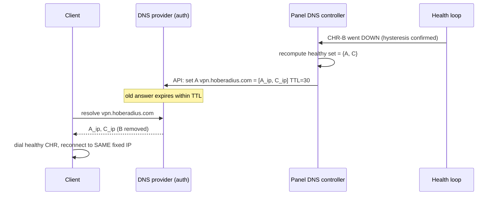

# 03 — Front Door: Health-Aware DNS

> One smart name, `vpn.hoberadius.com`, that customers always dial. The panel
> keeps it resolving **only to healthy CHRs**. Works for PPTP, SSTP, and
> IPsec/IKEv2 because all three dial a hostname.

---

## 3.1 Why DNS (and why this is the right front door)

The three VPN protocols in scope all take a **server hostname** in their client
config:

- **PPTP** → `pptp <host>` / Windows "VPN server address".
- **SSTP** → `https://<host>:443` (TLS over 443).
- **IPsec/IKEv2** → remote gateway `<host>`.

None of them require a fixed server IP — they re-resolve on connect. So the
cheapest, most universal "front door" is **a DNS name whose answer set is the
healthy CHRs**. No client agent, no owned IP space, no BGP. The panel becomes a
**health-aware authoritative-DNS driver**.



---

## 3.2 Record strategy

| Aspect | Decision | Rationale |
|---|---|---|
| Record name | `vpn.hoberadius.com` (single front door). Optionally per-region later: `eu.vpn…`, `me.vpn…`. | One thing customers memorize. |
| Record type | `A` (+ `AAAA` if CHR has v6). Multiple values = the healthy set. | Multi-value A gives client-side spread + retry. |
| **TTL** | **30 s** steady-state; drop to **20 s** during an active failover; never below 20 s (resolver floors). | Bounds worst-case stale-answer window ≈ TTL + resolver caching. |
| Answer ordering | Return **all** healthy IPs; let the brain bias by listing best-scored first (some resolvers honor order) + optionally weighted records where the provider supports it. | Spreads new connects without a hard LB. |
| Max answers | Cap at ~8 IPs to keep UDP DNS response < 512 B and avoid TCP fallback. If > 8 healthy, publish the top-8 by score. | Avoids truncation; top-8 is plenty of headroom. |
| Empty-set guard | **Never publish an empty record.** If all CHRs are DOWN, keep the last non-empty set and raise a CRIT alert. | A NXDOMAIN/empty answer = total outage; a stale-but-maybe-recovering IP is less bad. |

> **TTL trade-off, stated honestly:** lower TTL = faster failover but more DNS
> queries (cost) and more load on resolvers; 30 s is the commercial sweet spot.
> The hard floor on real-world failover is *TTL + client reconnect time*, not
> instant — documented as a limit in [09](09_OWNER_INPUTS_AND_RISKS.md).

---

## 3.3 DNS provider options for `hoberadius.com`

The owner controls `hoberadius.com`, so we delegate `vpn.hoberadius.com` (or the
whole zone) to a provider with a **fast, scriptable API** and **low minimum TTL**.

| Option | API | Min TTL | Health-check native? | Recommendation |
|---|---|---|---|---|
| **Cloudflare** | REST (`/zones/{id}/dns_records`), token-scoped | 60s (Free), 1s+ on paid via API; proxied/LB add-on supports health checks | Yes (Load Balancing add-on, paid) | **Recommended primary.** Token auth, instant propagation, optional native health-check LB. |
| **AWS Route 53** | API + **health checks + failover routing** built in | ~ any (record TTL configurable) | **Yes, first-class** (health checks → automatic failover/weighted) | Strong alternative; offloads health to AWS. More moving parts/cost. |
| **PowerDNS (self-hosted)** | HTTP API (`/api/v1/servers/.../zones`) | 1s | No (we drive it from our own health loop) | Full control, no third-party dependency; owner runs the authoritative server. |

**Decision for v1:** drive DNS from **our own health loop** (works with any of
the three), with **Cloudflare** as the recommended provider for its token-scoped
API and global anycast resolvers. Native provider health checks (Route53 /
Cloudflare LB) are an **optional belt-and-suspenders** layer, not the primary
mechanism — our loop already knows more (CPU, sessions, cost) than a generic
HTTP health check.

### 3.3.1 Cloudflare API call shape (illustrative)

```
# Update the A record set for the front door
PUT https://api.cloudflare.com/client/v4/zones/{zone_id}/dns_records/{record_id}
Authorization: Bearer {scoped_token}     # token limited to this zone, DNS:Edit
Content-Type: application/json
{ "type":"A", "name":"vpn.hoberadius.com", "content":"203.0.113.11", "ttl":30 }
```
Multi-value sets = one record per IP; the controller computes the **diff** between
`dns_records_state.published_ips` and the new healthy set, then creates/deletes
only the changed records (minimizes API calls + respects rate limits).

---

## 3.4 The health loop (front-door view)

Two independent signals decide if a CHR may appear in DNS:

1. **Liveness (ICMP ping)** — the agreed primary signal: a CHR failing ping for
   the configured window (~5 min, see §3.5) is removed.
2. **Data-path reachability** — can the CHR actually serve VPN? We add a
   lightweight **TCP check on 443 (SSTP)** and an **IKE UDP/500 probe** so a box
   that pings but can't terminate tunnels is also pulled. (CPU/session pressure
   does **not** remove a CHR from DNS — that's the *brain's* rebalancing job, not
   a health binary.)

```mermaid
flowchart TD
  A["Every PING_INTERVAL (e.g. 30s)"] --> B{ICMP ok?}
  B -- no --> C[consecutive_fail++]
  B -- yes --> D[consecutive_ok++ ; consecutive_fail=0]
  C --> E{fail window ≥ DOWN_AFTER<br/>(~5 min)?}
  E -- yes --> F[mark DOWN → remove from DNS set<br/>+ event + alert + trigger failover]
  E -- no --> G[stay in current state]
  D --> H{ok streak ≥ UP_AFTER<br/>(cooldown)?}
  H -- yes --> I[mark UP → eligible for DNS re-add]
  H -- no --> G
```

The DNS controller is **edge-triggered**: it only calls the provider API when the
computed healthy set differs from `dns_records_state`. See [05](05_LOAD_BALANCER_BRAIN.md)
§5.5 for the exact hysteresis numbers shared with the brain.

---

## 3.5 Failover timing budget (honest math)

| Stage | Typical | Notes |
|---|---|---|
| CHR actually fails | t=0 | |
| Ping window detects DOWN | up to ~5 min | the agreed `DOWN_AFTER`; tune lower (e.g. 90 s of 30 s pings) if faster failover desired and false-positives acceptable |
| Panel recomputes + calls DNS API | < 2 s | edge-triggered |
| DNS propagation (TTL expiry) | ≤ TTL (30 s) + resolver slack | some resolvers ignore low TTL — unavoidable |
| Client re-resolves + reconnects | seconds | client/OS dependent |

> **Two knobs, one trade-off.** `DOWN_AFTER` dominates the budget. The agreed
> ~5 min is conservative (avoids flapping on brief blips). For "seconds-class"
> failover, lower it to ~90 s and pair with `consecutive_fail ≥ 3` to keep
> false-positives down — documented as an owner choice in [09](09_OWNER_INPUTS_AND_RISKS.md).
> **Live sessions on the failed CHR still drop** (stateful tunnels) — DNS only
> fixes *new/reconnecting* dials. This is the physical limit, stated plainly.

---

## 3.6 Client configuration (what the customer sets)

| Protocol | Client setting | Value |
|---|---|---|
| PPTP | Server address | `vpn.hoberadius.com` |
| SSTP | Server / URL | `vpn.hoberadius.com` (443) |
| IPsec/IKEv2 | Remote gateway / Server | `vpn.hoberadius.com` |
| Username | RADIUS identity | `user@realm` (realm routes in the proxy) |

The customer **never** sees individual CHR IPs. SSTP needs a TLS cert valid for
`vpn.hoberadius.com` on **every** CHR — handled by the onboarding script (§ see
[06](06_ONBOARDING_WIZARD.md), shared cert/SNI provisioning). IPsec needs the same
identity (cert or PSK) fleet-wide so any CHR can terminate the same client.

---

## 3.7 Reconnection correctness (ties to fixed IP)

Because RADIUS hands the **same `Framed-IP-Address`** regardless of which CHR a
client lands on, a re-resolve after failover lands the user on a healthy CHR and
they keep their internal IP — "near-transparent roaming". The single-session +
kill-old guarantee ([04](04_FIXED_IP_AND_SESSIONS.md)) ensures the old (dead) session
is reaped so the IP isn't considered "in use" on the dead box. This is the
DNS↔RADIUS contract that makes the front door work.

---

## 3.8 Failure & edge cases

| Case | Behavior |
|---|---|
| All CHRs DOWN | Keep last non-empty DNS set; CRIT alert; do not publish empty. |
| DNS API unreachable | Retry with backoff; live record stays as-is (DNS keeps serving); WARN event. |
| Single CHR flapping | Hysteresis + cooldown keep it out of DNS until stable; `flap_count_1h` dampening (§[05](05_LOAD_BALANCER_BRAIN.md)). |
| New CHR onboarded | Added to DNS only after it passes health (status `up`), not at script-push time. |
| Provider-wide outage | All that provider's CHRs go DOWN → removed together; forced failover for their users; capacity headroom check before mass re-add elsewhere ([05](05_LOAD_BALANCER_BRAIN.md) thundering-herd). |
