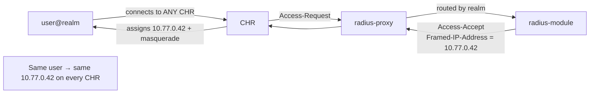

# 04 — Fixed IP, Roaming & Single-Session Enforcement

> RADIUS is the **sole** source of each user's private IP. Every CHR is
> configured identically with **no local pool**. This document defines IP
> allocation, single-session enforcement, the CoA/kill-old-session flow, and why
> roaming is correct (no duplicate IPs — goal **G2**).

---

## 4.1 The core invariant

> **A user's `Framed-IP-Address` is a property of the user, not of the CHR.**

- The customer's RADIUS (`radius-module`) returns the **same** `Framed-IP-Address`
  (RADIUS attr 8 — already parsed in `radius_packet.py:ATTR_FRAMED_IP_ADDRESS`)
  for a given username on **every** Access-Accept, on **every** CHR.
- CHRs have **no IP pool** of their own for VPN clients. RouterOS PPP/IPsec
  profiles are configured to take the address **from RADIUS only** (see the
  onboarding template, [06](06_ONBOARDING_WIZARD.md) §6.5). If RADIUS returns no
  IP, the connection is refused — never a CHR-assigned address.
- Therefore two CHRs can **never** hand out the same IP independently, and a user
  roaming from CHR-A to CHR-C gets the identical internal IP → existing internal
  routes/firewall rules keyed on that IP keep working.



---

## 4.2 IP plan

A single, fleet-wide private range is carved per customer so addresses never
collide across customers or CHRs.

| Layer | Allocation | Owner |
|---|---|---|
| Per-customer client range | e.g. `10.<cust>.0.0/16` mapped from `customer_id` | `radius-module` (`fixed_ip_pool`) |
| Per-user fixed IP | deterministic: stored mapping `username → framed_ip`, allocated once at user creation, never reused while user exists | `radius-module` |
| CHR-side | **no pool**; PPP/IPsec `local-address` is a CHR gateway IP, `remote-address` comes from RADIUS | onboarding template |
| NAT | each CHR masquerades the customer range out its public IP | onboarding template |

**Allocation discipline (in `radius-module`):**
- `fixed_ip` column is `UNIQUE` — DB rejects accidental duplicates.
- Allocation is idempotent: re-running for an existing user returns the existing IP.
- De-allocation only on user delete (or explicit release), to avoid churn that
  would break the "same IP forever" promise.

The panel mirrors this read-only into `users_fleet.fixed_ip` (via the Acct
placement feed or a direct read) for dedupe visibility — see [02](02_DATA_MODEL.md) §2.6/§2.12.

---

## 4.3 Why duplicate IPs are impossible (defense in depth)

Three independent layers all enforce **G2**:

1. **Source-of-truth layer:** only RADIUS assigns IPs; CHRs have no pool → no
   independent allocation path exists.
2. **Allocation layer:** `fixed_ip_pool.framed_ip UNIQUE` in `radius-module` →
   one IP can map to at most one user.
3. **Runtime layer:** `sessions` partial unique indexes in the panel
   (`uq_active_session_per_user`, `uq_active_ip`) → at most one *active* session
   per user and per IP fleet-wide; combined with kill-old-session (§4.4), the IP
   is never live on two CHRs simultaneously.

---

## 4.4 Single-session enforcement & kill-old-session (CoA flow)

**Goal:** when a user connects (or reconnects after roaming/failover), any
*previous* session for that user must be torn down so the fixed IP is live in
exactly one place.

### 4.4.1 Detection

The panel's `sessions` table is fed by the proxy's **placement hook** on
Accounting-Start. The moment a new Acct-Start arrives for `username` while an
`active` row already exists on a *different* CHR, that's a reconnect → trigger
kill-old.

> Why server-side and not CHR-side? Because the old and new sessions are on
> **different CHRs** (roaming/failover). No single CHR can see both. Only the
> panel (via the proxy's fleet-wide session view) can.

### 4.4.2 Kill-old sequence

```mermaid
sequenceDiagram
  participant NewCHR
  participant Proxy as radius-proxy
  participant RAD as radius-module
  participant Panel
  participant OldCHR

  NewCHR->>Proxy: Access-Request user@realm
  Proxy->>RAD: (re-signed) Access-Request
  RAD-->>Proxy: Access-Accept (Framed-IP 10.77.0.42)
  Proxy-->>NewCHR: Access-Accept
  NewCHR->>Proxy: Accounting-Start (acct_session_id=NEW)
  Proxy->>Panel: POST /api/proxy/placement (user, NewCHR, IP, NEW)
  Panel->>Panel: active row exists on OldCHR? YES
  Panel->>Proxy: POST /api/proxy/coa {disconnect, realm, acct_session_id=OLD, chr=OldCHR}
  Proxy->>OldCHR: RADIUS Disconnect-Request (RFC 5176) :3799
  OldCHR-->>Proxy: Disconnect-ACK
  Proxy->>Panel: coa result OK
  Panel->>Panel: close OLD row; NEW becomes the sole active session
```

**Race handling — "new wins":** the new session is allowed to come up
immediately; the old one is reaped asynchronously (typically < 1–2 s). During the
brief overlap the DB has both rows momentarily; we resolve by:
- Inserting the NEW row with `state='active'`; if the `uq_active_session_per_user`
  unique index conflicts, first transition the OLD row to `state='closing'` in the
  same transaction, then insert NEW. (App handles the upsert atomically.)
- The fixed IP being briefly announced from two CHRs is harmless for *new* flows
  because the dead/old tunnel is being torn down; return traffic correctness is
  guaranteed once the OLD session closes. (For the rare double-live case, the
  CoA disconnect resolves it within seconds.)

### 4.4.3 The CoA / Disconnect mechanics (concrete)

- **Protocol:** RADIUS Disconnect-Request (code 40) / CoA-Request (code 43),
  RFC 5176, sent to the CHR's **CoA port 3799** over `wg-data`.
- **Origin:** `radius-proxy` (new `coa.py`), because it holds the CHR shared
  secret and is on the WireGuard network. The panel asks via `POST /api/proxy/coa`.
- **Session identification attributes** in the Disconnect-Request:
  `Acct-Session-Id` (44) + `User-Name` (1) + `NAS-IP-Address` (4) of the target CHR.
- **RouterOS support:** RouterOS PPP/IPsec honor incoming Disconnect when the
  RADIUS client has `accounting=yes` and an `incoming` CoA listener is enabled
  (set by the onboarding template, [06](06_ONBOARDING_WIZARD.md)).
- **Auth of the CoA itself:** signed with the CHR shared secret (same one the CHR
  uses toward the proxy), so RouterOS accepts it; the proxy fills the
  Request-Authenticator per RFC 5176 §2.3.

### 4.4.4 If the old CHR is DOWN (failover case)

The old CHR can't ACK a Disconnect because it's dead — that's fine: its tunnels
are already gone. The panel simply marks the OLD `sessions` row `closed` after the
CoA attempt times out, and the NEW session stands. (No duplicate live IP because
the dead box isn't forwarding.) This is logged as `coa_sent` with `outcome=failed`
+ `move_ok` for the user.

---

## 4.5 Forced move (load-balance / evacuate) vs reconnect

There are two reasons a session changes CHR:

| Trigger | Mechanism | Affects |
|---|---|---|
| **User reconnects** (client re-dials front door) | Natural: new Access-Request → new placement; old reaped via §4.4 | the reconnecting user |
| **Brain decides to move** (rebalance or forced failover) | Panel sends **Disconnect** to the user's *current* CHR; client auto-redials `vpn.hoberadius.com`; DNS now points only at healthy/better CHRs → lands on the chosen target; same fixed IP | a movable user (rebalance) or all affected users (failover) |

> **Important honesty:** a "move" is implemented as a **controlled disconnect +
> reconnect**, not a live tunnel transfer. The user sees a brief reconnect
> (seconds). This is the only physically possible mechanism for stateful tunnels
> and is the same limit documented in [01](01_ARCHITECTURE.md)/[03](03_FRONT_DOOR_DNS.md)/[09](09_OWNER_INPUTS_AND_RISKS.md).
> To bias *which* CHR the reconnect lands on, the brain can temporarily shape the
> DNS answer (drain the source, prefer the target) for that move window.

---

## 4.6 Accounting as the placement source of truth

The proxy already forwards Accounting (1813). We add a **placement hook**
(`placement_hook.py`) that, on Acct-Start/Stop/Interim, posts to
`POST /api/proxy/placement`:

```json
{ "event":"start",
  "username":"bob@client5", "realm":"client5",
  "chr_public_ip":"203.0.113.11", "framed_ip":"10.77.0.42",
  "acct_session_id":"8f2c...", "nas_ip":"203.0.113.11", "ts": 1733740800 }
```

This keeps `sessions` aligned with reality even when users reconnect on their own,
and provides the `bytes_in/out` deltas that roll up into `chr_metrics` usage and
the cost-aware scoring ([05](05_LOAD_BALANCER_BRAIN.md)).

---

## 4.7 Edge cases & correctness checklist

| Case | Handling |
|---|---|
| Two simultaneous connects, same user, two CHRs | Both Acct-Starts hit panel; the *later* one triggers kill-old of the earlier; the DB unique index guarantees a single survivor. |
| Missing `Framed-IP-Address` in Accept | CHR refuses the connection (no local pool). Surfaced as an event; alerts if frequent (RADIUS misconfig). |
| Acct-Stop lost (UDP) | Interim-Update + a stale-session reaper (no Acct activity > N min → mark `closed`) prevents ghost active rows blocking reconnect. |
| User has `movable=false` | Never moved during rebalance; **still** force-moved on outage (G3 > opt-in). |
| Same IP requested by RADIUS for two different users | Impossible: `fixed_ip_pool.framed_ip UNIQUE` in `radius-module`. |
| CoA port blocked | Onboarding template opens 3799 only on `wg-data`; health check verifies CoA reachability post-onboard. |
