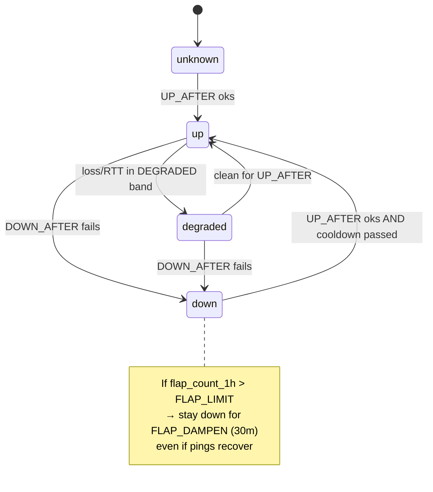
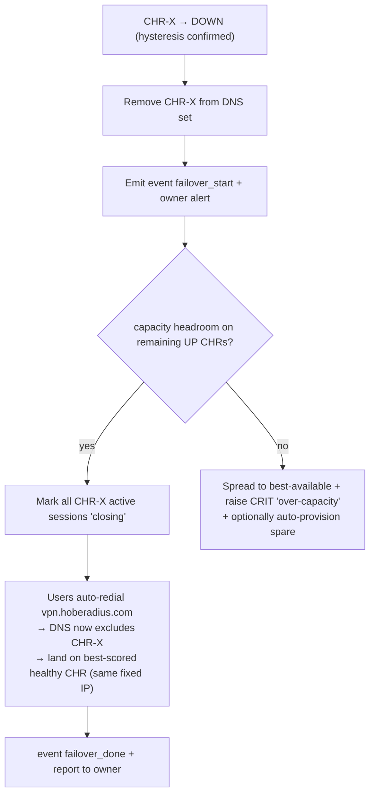

# 05 — Load-Balancer Brain (Scoring, Placement, Failover)

> The decision engine inside `radius-module-admin`. It ranks every CHR, places
> new sessions on the best one, rebalances movable users off bad CHRs, fills
> open/unlimited providers before metered ones, and on outage force-migrates
> everyone. All numbers below are concrete defaults the owner can tune.

---

## 5.1 Inputs (per CHR, per scoring tick)

| Symbol | Source | Meaning |
|---|---|---|
| `health` | `chr_health.state` | `up` / `degraded` / `down` |
| `cpu` | `chr_nodes.cpu_pct` (control-plane sample) | CPU % (0–100) |
| `sessions` | `chr_nodes.active_sessions` | current sessions |
| `max_sessions` | `chr_nodes.max_sessions` | declared cap |
| `cost_model` | `chr_effective.eff_cost_model` | `open` / `metered` |
| `price` | `chr_effective.eff_price_per_tb` | $/TB (metered) |
| `cap_tb` | `chr_effective.eff_cap_tb` | monthly cap (metered) |
| `used_tb` | `chr_nodes.used_tb_cycle` | bandwidth used this cycle |
| `link` | `chr_nodes.link_speed_mbps` | uplink speed |
| `tx_rate` | derived from `chr_metrics` | current throughput |
| `weight` | `chr_nodes.weight` | manual operator multiplier |

Scoring tick runs every **`SCORE_INTERVAL = 30 s`** (configurable). Health ping
runs every **`PING_INTERVAL = 30 s`** independently.

---

## 5.2 The score (0–100, higher = better)

A CHR that is `down` or `disabled` or `drain` is **excluded** (not scored, never a
placement target). For eligible CHRs:

```
score = 100
        * health_factor          # 1.0 up, 0.5 degraded, 0 down (excluded)
        * weight                 # operator preference (default 1.0)
        - cpu_penalty
        - capacity_penalty
        - cost_penalty
        - bandwidth_penalty
        + spare_capacity_bonus
```

Clamp to `[0, 100]`. Persisted in `chr_nodes.score` and the `reason` JSON of
`placement_decisions` for auditability.

### 5.2.1 CPU penalty (sheds load above 70%)

```
if cpu <= 50:          cpu_penalty = 0
elif cpu <= 70:        cpu_penalty = (cpu - 50) * 0.5        # 0 → 10 ramp
elif cpu <= 90:        cpu_penalty = 10 + (cpu - 70) * 2.0   # 10 → 50 steep
else:                  cpu_penalty = 50 + (cpu - 90) * 5.0   # 50 → 100 cliff
```

- **70% is the shed threshold** (agreed): above it, the steep slope makes the CHR
  fall behind peers fast, so new placements avoid it and rebalance starts pulling
  movable users off.
- The cliff above 90% effectively removes it from new placement without marking it
  DOWN (it's still serving existing sessions).

### 5.2.2 Capacity penalty (free session headroom)

```
util = sessions / max_sessions          # 0..1+
capacity_penalty = 40 * max(0, util - 0.6) / 0.4    # 0 below 60%, 40 at 100%
# beyond 100% (over cap): hard exclude from NEW placement
if util >= 1.0: exclude_for_new_placement = True
spare_capacity_bonus = 10 * (1 - min(util, 1))      # rewards empty CHRs for fill
```

### 5.2.3 Cost penalty — open preferred, metered penalized near cap

This is the cost-aware brain. **Open/unlimited providers get zero cost penalty**
(they're free to fill). Metered providers get a penalty that **grows as usage
approaches the cap**, and scales with price:

```
if cost_model == 'open':
    cost_penalty = 0
else:  # metered
    cap_frac = used_tb / cap_tb                       # 0..1+ of monthly cap
    price_norm = min(price / PRICE_REF, 2.0)          # PRICE_REF e.g. $5/TB
    # base penalty rises with price; cap_frac multiplies it super-linearly
    cost_penalty = (8 * price_norm) * (cap_frac ** 2) * 50
    # examples below
```

`cap_frac**2` makes the penalty small early in the month and **sharply larger** as
the metered link nears its cap — so traffic naturally drains toward open providers
exactly when the metered one is getting expensive/full.

| used/cap | price | cost_penalty (approx) | effect |
|---|---|---|---|
| 0.10 | $5/TB | ~0.8 | negligible — metered usable early |
| 0.50 | $5/TB | ~20 | noticeable — start preferring open |
| 0.80 | $5/TB | ~51 | strong — avoid for new placement |
| 0.95 | $5/TB | ~72 | near-exclude |
| ≥ cap, `overage_allowed=false` | — | **exclude** | hard stop at cap |
| ≥ cap, `overage_allowed=true` | — | penalty caps at ~95 | usable only if nothing else |

### 5.2.4 Bandwidth penalty (live throughput vs link)

```
load = tx_rate / (link_speed_mbps)        # 0..1
bandwidth_penalty = 30 * max(0, load - 0.7) / 0.3   # 0 below 70%, 30 at saturation
```
Prevents piling onto a CHR whose pipe is already saturated even if CPU is fine.

---

## 5.3 Bandwidth accounting (used_tb_cycle) — getting it right

`used_tb_cycle` is the sum of session bytes (from Acct) **and/or** interface
counter deltas (from control-plane `rx_bytes/tx_bytes`). Pitfalls handled:

- **Counter reset on reboot:** if a new sample is *smaller* than the previous,
  treat as reset → add the new value, don't go negative.
- **Billing cycle reset:** at `providers.billing_cycle_day`, zero `used_tb_cycle`
  and snapshot the closing value into `events` for invoicing/audit.
- **Source preference:** interface counters (control-plane) are authoritative for
  provider billing; Acct bytes are per-user attribution. Reconcile nightly.

---

## 5.4 Placement decisions

### 5.4.1 New connection (implicit via DNS + which CHR answers)

New connections are steered by **two** levers working together:
1. **DNS answer set** ([03](03_FRONT_DOOR_DNS.md)) — only healthy CHRs appear, best-scored first.
2. **Fill order** — when biasing the DNS order / weighted records, sort eligible
   CHRs by `score DESC`, but apply the **fill rule**:

```
eligible = [c for c in chrs if c.health==up and not c.drain and util<1 and not over_cap_excluded]
# Fill open providers first:
order = sort(eligible, key = (cost_model=='metered',   # open (False) sorts first
                              -score))                  # then by score desc
publish top-8 of `order` to DNS; new dials land on open/best first.
```

So: **open/unlimited providers fill first; metered providers receive new
connections only when open capacity is constrained or their score wins despite the
cost penalty.**

### 5.4.2 Manual placement / pin

Owner can `pinned_chr_id` a user (`users_fleet`) — the brain respects the pin
unless that CHR is DOWN (then forced failover overrides the pin, logged).

---

## 5.5 Health state machine + hysteresis (anti-flapping)

Shared by the DNS controller ([03](03_FRONT_DOOR_DNS.md)) and the brain.

```
Thresholds (defaults):
  PING_INTERVAL      = 30 s
  DOWN_AFTER         = 10 consecutive fails  (~5 min)   # agreed ~5 min
  UP_AFTER           = 4 consecutive oks      (~2 min)   # slower to re-add than to remove
  DEGRADED_LOSS      = ping loss 20–60% or RTT > 300 ms
  STATE_COOLDOWN     = 120 s   # min dwell before another transition
  FLAP_LIMIT_1H      = 4       # transitions/hour before dampening
  FLAP_DAMPEN        = hold DOWN for 30 min if FLAP_LIMIT exceeded
```



**Why asymmetric (fast down, slow up):** removing a bad CHR quickly protects
users; re-adding slowly avoids yo-yo. `STATE_COOLDOWN` + `FLAP_DAMPEN` stop a
half-dead box from oscillating in and out of DNS.

---

## 5.6 Rebalancing & forced failover

### 5.6.1 Normal rebalance (opt-in only)

Runs every `REBALANCE_INTERVAL = 5 min`. For each CHR whose `score` is below
`REBALANCE_FLOOR = 40` **or** `cpu > 70%` **or** `util > 0.9` **or** metered
`cap_frac > 0.85`:

```
overloaded = those CHRs (the "source" set)
targets    = eligible CHRs with score >= source.score + REBALANCE_MARGIN(=15)
movable    = active sessions on `overloaded` whose user.movable == TRUE
# Move only enough to bring source below threshold; do NOT thrash:
for user in movable (oldest-first, capped at MOVE_BATCH=10 per tick):
    if a target with headroom exists:
        record placement_decision(kind='rebalance', from, to, reason)
        issue controlled disconnect (CoA) → client redials → lands on target
```

- `REBALANCE_MARGIN = 15` points: never move a user to a CHR that isn't clearly
  better (prevents ping-pong between near-equal CHRs).
- `MOVE_BATCH` + per-tick cap = gentle drain, not a stampede.
- **Only `movable=true` users move in normal rebalance.**

### 5.6.2 Forced failover (outage — overrides movable)

Triggered the instant a CHR transitions to `down` (or a whole provider's CHRs do):



- **All** affected users transfer, regardless of `movable` (goal **G3**).
- Live tunnels on CHR-X already dropped (physical limit). The brain's job is to
  make the **reconnect** land well and fast.
- The DNS bias (drain source, prefer least-loaded healthy targets) spreads the
  returning herd instead of dumping everyone on the single best CHR.

### 5.6.3 Thundering-herd mitigation

| Risk | Mitigation |
|---|---|
| All of CHR-X's users reconnect at once onto one CHR | DNS publishes the **top-N healthy** CHRs (not just #1), spreading reconnects; weighted/multi-answer records. |
| Targets get overloaded → cascade failure | Capacity headroom check **before** failover: required headroom = sum of CHR-X sessions; if insufficient, spread + CRIT alert (+ optional auto-provision a spare CHR via onboarding API). |
| Reconnect storm hammers RADIUS | Proxy + RADIUS already async/UDP; recommend RADIUS-side rate limonitoring; staggered TTL/reconnect smooths arrival. |
| CPU spikes on targets push them >70% → secondary rebalance | `STATE_COOLDOWN` + not rebalancing during an active failover window prevents secondary churn. |

### 5.6.4 Capacity headroom rule (always-on guardrail)

```
total_capacity   = sum(max_sessions for UP, non-drain CHRs)
total_active      = sum(active_sessions fleet-wide)
fleet_headroom    = total_capacity - total_active
# Alert owner when headroom < largest single CHR's sessions (can't absorb one loss)
if fleet_headroom < max(active_sessions over CHRs):
    event('cap_warn', severity='warn')  → owner alert "add a CHR"
```

This is what lets the owner know **before** an outage that the fleet can't survive
losing its biggest node — turning capacity planning into a proactive alert.

---

## 5.7 Worked example

Three CHRs, mid-month:

| CHR | provider | health | cpu | util | cost | used/cap | score (computed) |
|---|---|---|---|---|---|---|---|
| A | P1 open | up | 45% | 0.40 | open | — | ~104→**100** (bonus clamps) |
| B | P2 metered $5 | up | 60% | 0.55 | metered | 0.80 | 100−5−0−51−0+4.5 ≈ **48** |
| C | P3 open | up | 82% | 0.30 | open | — | 100−34−0−0−0+7 ≈ **73** |

Fill order for new connections: **A (open, 100) → C (open, 73) → B (metered, 48)**.
B is avoided not because it's unhealthy but because it's 80% into a paid cap.
If C's CPU keeps climbing past 90, it drops out of new placement and movable users
drain to A. If A goes DOWN, forced failover moves everyone to C then B (headroom
permitting), and the owner is alerted.

---

## 5.8 Tunables summary (single source of truth)

| Param | Default | Doc ref |
|---|---|---|
| `PING_INTERVAL` | 30 s | §5.5 |
| `DOWN_AFTER` | 10 fails (~5 min) | §5.5, [03](03_FRONT_DOOR_DNS.md) |
| `UP_AFTER` | 4 oks (~2 min) | §5.5 |
| `STATE_COOLDOWN` | 120 s | §5.5 |
| `FLAP_LIMIT_1H` / `FLAP_DAMPEN` | 4 / 30 min | §5.5 |
| `SCORE_INTERVAL` | 30 s | §5.1 |
| `CPU shed threshold` | 70% | §5.2.1 |
| `REBALANCE_INTERVAL` | 5 min | §5.6.1 |
| `REBALANCE_FLOOR` / `REBALANCE_MARGIN` | 40 / 15 | §5.6.1 |
| `MOVE_BATCH` | 10/tick | §5.6.1 |
| `PRICE_REF` | $5/TB | §5.2.3 |
| `cap drain exponent` | 2 (`cap_frac**2`) | §5.2.3 |

All live in a single config module in the panel so one agent owns the tunables
file (see [08](08_PHASED_PLAN.md)).
