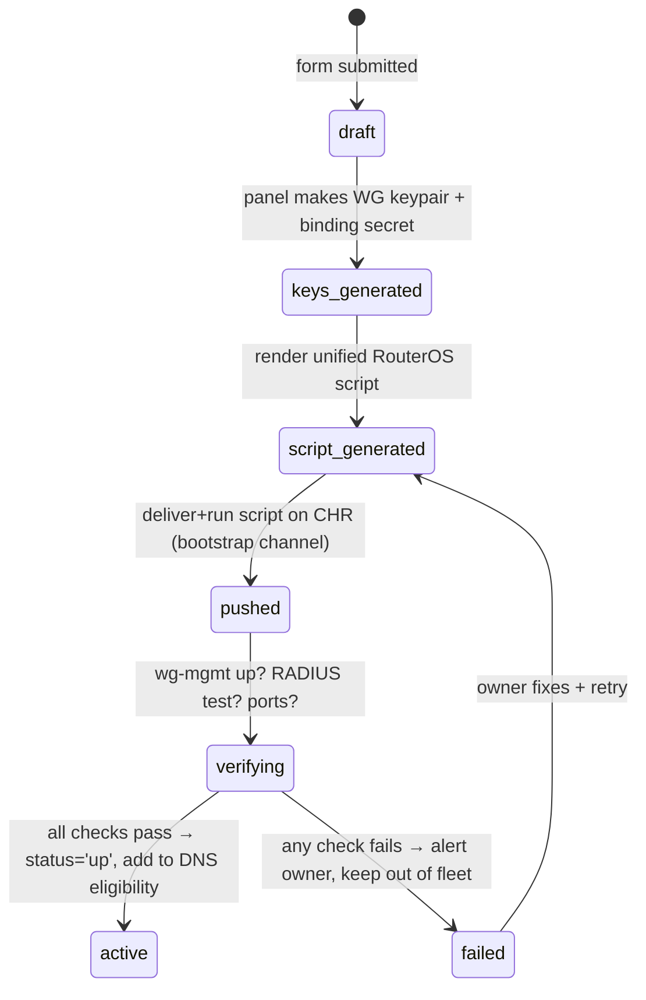
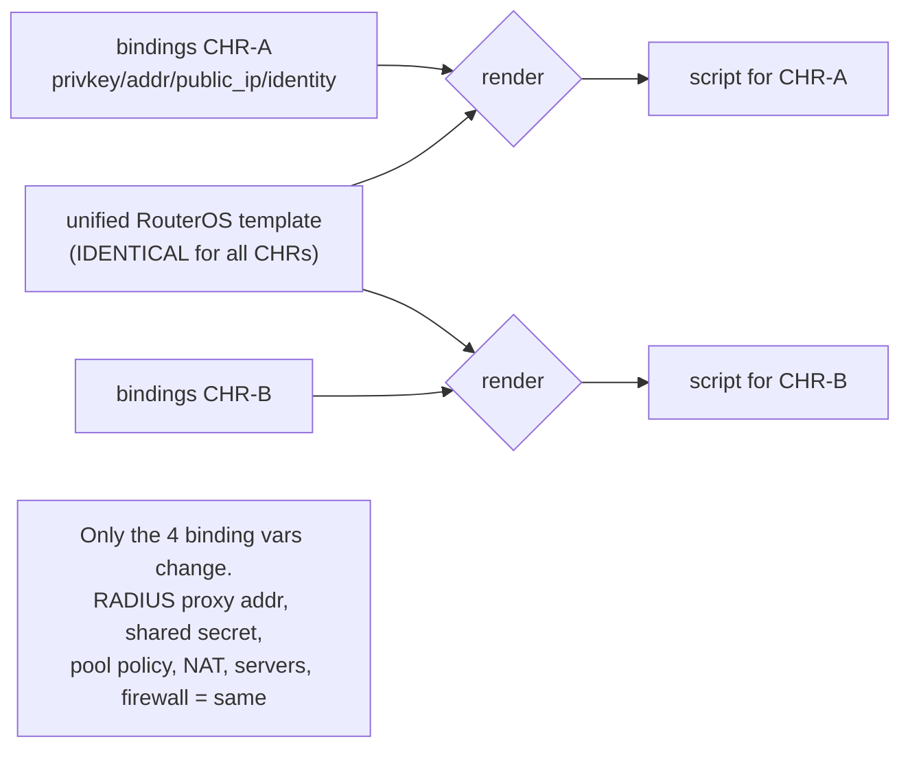

# 06 — Auto-Onboarding Wizard

> The owner fills one short form per new CHR. The panel auto-generates a
> **WireGuard control tunnel** and a **single unified RouterOS script** — the
> SAME script for every CHR, only the binding credentials differ — that stands up
> PPTP/SSTP/IPsec, the RADIUS-only IP policy, NAT, and masquerade. Then the panel
> health-checks and starts collecting metrics automatically.

---

## 6.1 Wizard fields (the only human input)

| Field | Type | Example | Maps to |
|---|---|---|---|
| Provider | select/new | "Contabo" | `providers.name` (+ creates row) |
| CHR name/label | text | "contabo-de-01" | `chr_nodes.name` |
| Public IP (v4) | ip | `203.0.113.11` | `chr_nodes.public_ip` |
| Public IP (v6, opt) | ip | — | `chr_nodes.public_ipv6` |
| Capacity (max sessions) | int | `500` | `chr_nodes.max_sessions` |
| Link speed (Mbps) | int | `1000` | `chr_nodes.link_speed_mbps` |
| Bandwidth model | select | open / metered | `cost_model` |
| Monthly cap (TB) | num (metered) | `30` | `bandwidth_cap_tb` |
| Overage allowed? | bool | false | `overage_allowed` |
| Price per TB | num (metered) | `5.00` | `price_per_tb` |
| Weight (opt) | num | `1.0` | `chr_nodes.weight` |
| Initial RouterOS reach | host:port + creds (one-time) | api/ssh to bootstrap wg | used once, not stored plaintext |

Everything else (WireGuard keys, RADIUS client config, IP pool policy, NAT,
firewall, PPTP/SSTP/IPsec servers) is **generated** — the owner never writes
RouterOS config.

---

## 6.2 Onboarding state machine



Tracked in `onboarding_jobs.status` ([02](02_DATA_MODEL.md) §2.10).

---

## 6.3 What the panel generates (per CHR)

1. **WireGuard control keypair** for `wg-mgmt` (CHR side private key stays on the
   CHR / vault-referenced; panel stores only the **public** key in
   `chr_nodes.wg_mgmt_pubkey`). The panel's own `wg-mgmt` interface adds this CHR
   as a peer.
2. **Per-CHR binding credentials** — the *only* values that differ between CHRs:
   - `WG_MGMT_PRIVKEY` (CHR's control-tunnel private key)
   - `WG_MGMT_ADDR` (e.g. `10.99.0.11/32`)
   - `CHR_PUBLIC_IP` (its own public IP, for NAT/masquerade out-interface)
   - `ROUTER_IDENTITY` (label)
   All other knobs (RADIUS proxy address, shared secret, IP-from-RADIUS policy,
   protocol servers, firewall) are **identical fleet-wide**.
3. **The unified RouterOS script** (§6.5), rendered with those bindings.

---

## 6.4 Parameterization model



This is the core onboarding promise: **same script, different credentials.**

---

## 6.5 The unified RouterOS script (template)

> RouterOS 7.x syntax. `{{...}}` are render-time bindings (the only per-CHR
> differences). Everything else is fleet-constant. Comments explain intent.
> **No client IP pool is defined — addresses come from RADIUS only** (enforces
> the fixed-IP invariant, [04](04_FIXED_IP_AND_SESSIONS.md)).

```routeros
# ============================================================
# HobeRadius unified CHR provisioning script  (v1)
# IDENTICAL across the fleet — only {{BINDINGS}} differ.
# ============================================================

/system identity set name="{{ROUTER_IDENTITY}}"

# ---- 1. WireGuard CONTROL tunnel (wg-mgmt) -----------------
# Control/telemetry ONLY. No default route, no NAT, no forwarding over this.
/interface wireguard
add name=wg-mgmt listen-port=51820 private-key="{{WG_MGMT_PRIVKEY}}"
/interface wireguard peers
add interface=wg-mgmt public-key="{{PANEL_WG_PUBKEY}}" \
    endpoint-address={{PANEL_WG_ENDPOINT}} endpoint-port=51820 \
    allowed-address={{PANEL_WG_ADDR}}/32 persistent-keepalive=25s
/ip address
add interface=wg-mgmt address={{WG_MGMT_ADDR}}     ;# e.g. 10.99.0.11/32

# ---- 2. WireGuard DATA path to RADIUS proxy (wg-data) ------
# Carries ONLY RADIUS 1812/1813 + CoA 3799 to the proxy.
/interface wireguard
add name=wg-data listen-port=51821 private-key="{{WG_DATA_PRIVKEY}}"
/interface wireguard peers
add interface=wg-data public-key="{{PROXY_WG_PUBKEY}}" \
    endpoint-address={{PROXY_WG_ENDPOINT}} endpoint-port=51821 \
    allowed-address={{PROXY_WG_ADDR}}/32 persistent-keepalive=25s
/ip address
add interface=wg-data address={{WG_DATA_ADDR}}     ;# e.g. 10.98.0.11/32

# ---- 3. RADIUS client → the central proxy (FLEET-CONSTANT) -
/radius
add service=ppp,login address={{PROXY_WG_ADDR}} secret="{{CHR_SHARED_SECRET}}" \
    authentication-port=1812 accounting-port=1813 \
    src-address={{WG_DATA_ADDR_IP}} timeout=3s
/radius incoming
# Enable CoA / Disconnect listener so panel can kill/move sessions (RFC 5176)
set accept=yes port=3799

# Make PPP + login use RADIUS:
/ppp aaa
set use-radius=yes accounting=yes interim-update=5m

# ---- 4. IP-FROM-RADIUS ONLY (no local pool!) --------------
# default-profile must NOT reference any local-address pool for clients.
/ppp profile
set default-encryption local-address={{GW_LOCAL_ADDR}} \
    use-encryption=required dns-server={{DNS_PUSH}} \
    # remote-address comes from RADIUS Framed-IP-Address — NO pool here
    only-one=yes        ;# refuse 2nd simultaneous session on THIS box

# ---- 5. PPTP server ---------------------------------------
/interface pptp-server server
set enabled=yes authentication=mschap2 default-profile=default-encryption \
    keepalive-timeout=30

# ---- 6. SSTP server (TLS 443) -----------------------------
# Shared cert valid for vpn.hoberadius.com installed on EVERY CHR.
/interface sstp-server server
set enabled=yes port=443 authentication=mschap2 \
    certificate={{SSTP_CERT_NAME}} tls-version=only-1.2 \
    default-profile=default-encryption verify-client-certificate=no

# ---- 7. IPsec / IKEv2 server ------------------------------
/ip ipsec profile
add name=hobe-ike dh-group=modp2048 enc-algorithm=aes-256 hash-algorithm=sha256
/ip ipsec proposal
add name=hobe-prop enc-algorithms=aes-256-cbc,aes-256-gcm pfs-group=modp2048
/ip ipsec mode-config
# Address ALSO via RADIUS for IKEv2 (no local pool); identity = vpn.hoberadius.com
add name=hobe-mc responder=yes
/ip ipsec identity
add auth-method=eap-radius generate-policy=port-strict mode-config=hobe-mc \
    peer=hobe-peer certificate={{IKE_CERT_NAME}}
/ip ipsec peer
add name=hobe-peer exchange-mode=ike2 profile=hobe-ike passive=yes

# ---- 8. NAT / masquerade to the internet ------------------
# Client (RADIUS-assigned) range egresses via this CHR's public IP.
/ip firewall nat
add chain=srcnat action=masquerade out-interface={{WAN_IFACE}} \
    src-address={{CLIENT_SUPERNET}}     ;# e.g. 10.0.0.0/8 fleet client supernet

# ---- 9. Firewall: RADIUS/CoA only over wg, never public ---
/ip firewall filter
add chain=input in-interface=wg-data protocol=udp dst-port=1812,1813 action=accept
add chain=input in-interface=wg-data protocol=udp dst-port=3799 action=accept
add chain=input in-interface=wg-mgmt action=accept comment="control plane"
add chain=input protocol=udp dst-port=1812,1813,3799 action=drop comment="never public"
# Allow VPN protocols inbound on WAN:
add chain=input in-interface={{WAN_IFACE}} protocol=tcp dst-port=443 action=accept ;# SSTP
add chain=input in-interface={{WAN_IFACE}} protocol=tcp dst-port=1723 action=accept ;# PPTP ctrl
add chain=input in-interface={{WAN_IFACE}} protocol=gre action=accept               ;# PPTP data
add chain=input in-interface={{WAN_IFACE}} protocol=udp dst-port=500,4500 action=accept ;# IKE

# ---- 10. control-plane is NOT a data route ----------------
# Ensure wg-mgmt carries no default route / no forwarding (invariant).
/ip route
# (no default via wg-mgmt — intentionally absent)
```

### 6.5.1 The per-CHR bindings (the ONLY differences)

| Binding | Per-CHR? | Source |
|---|---|---|
| `WG_MGMT_PRIVKEY`, `WG_MGMT_ADDR` | **yes** | generated |
| `WG_DATA_PRIVKEY`, `WG_DATA_ADDR` | **yes** | generated |
| `ROUTER_IDENTITY`, `CHR_PUBLIC_IP`, `WAN_IFACE` | **yes** | form / detected |
| `PANEL_WG_PUBKEY/ENDPOINT/ADDR`, `PROXY_WG_PUBKEY/ENDPOINT/ADDR` | no (fleet-constant) | panel config |
| `CHR_SHARED_SECRET` | **shared** (one secret all CHRs use to the proxy — matches `PROXY_CHR_SECRET`, see `config.py`) | panel config |
| `SSTP_CERT_NAME`, `IKE_CERT_NAME`, `CLIENT_SUPERNET`, `DNS_PUSH`, `GW_LOCAL_ADDR` | no (fleet-constant) | panel config |

> The shared `CHR_SHARED_SECRET` matches the proxy's existing
> `PROXY_CHR_SECRET` / `Config.CHR_SHARED_SECRET` (single secret for all CHRs in
> the current MVP — `config.py:89`). A future hardening (per-CHR secrets) is noted
> in [09](09_OWNER_INPUTS_AND_RISKS.md).

---

## 6.6 Delivery & bootstrap

The first push needs an initial channel to the CHR before `wg-mgmt` exists:

1. Owner provides one-time RouterOS reachability (API/SSH on the provider's
   default management address) in the wizard.
2. Panel connects once, runs the script (which *creates* `wg-mgmt`), then
   **switches to `wg-mgmt`** for all future commands and the one-time channel can
   be closed/firewalled.
3. The SSTP/IKE certificate for `vpn.hoberadius.com` is pushed (uploaded +
   imported) as part of provisioning; a fleet-wide cert (or per-CHR cert with the
   same SAN) lets any CHR terminate the same client.

---

## 6.7 Post-push verification (auto)

`verifying` state runs these and only promotes to `active` if all pass:

| Check | How | Pass criteria |
|---|---|---|
| Control tunnel | `wg-mgmt` handshake + RouterOS API ping | reachable < 2s |
| RADIUS path | send a test Access-Request through proxy (dummy realm) | proxy logs the CHR as allowed source |
| CoA reachability | panel asks proxy to send a no-op CoA | 3799 reachable over wg-data |
| Protocol ports | TCP 443, 1723, UDP 500/4500 listening | open on WAN |
| No data leak on wg-mgmt | route table check | no default route via wg-mgmt |
| Metrics | first `chr_metrics` sample arrives | CPU/sessions populated |

On success: `chr_nodes.status='up'`, node becomes DNS-eligible, brain starts
scoring it. On failure: `onboarding_jobs.status='failed'`, owner alerted, node
kept **out** of the fleet (never half-onboarded into DNS).

---

## 6.8 Identical-config guarantees (why this is safe)

- Because every CHR runs byte-identical policy (except bindings), a user
  authenticating anywhere gets the same treatment and the same RADIUS-assigned
  IP → roaming + failover "just work".
- `only-one=yes` in the PPP profile blocks a 2nd session **on the same box**;
  cross-box single-session is enforced fleet-side via CoA ([04](04_FIXED_IP_AND_SESSIONS.md)).
- Re-running onboarding is **idempotent** (script uses `set`/`add` patterns that
  the panel can make safe by checking existence first in the rendered script).
