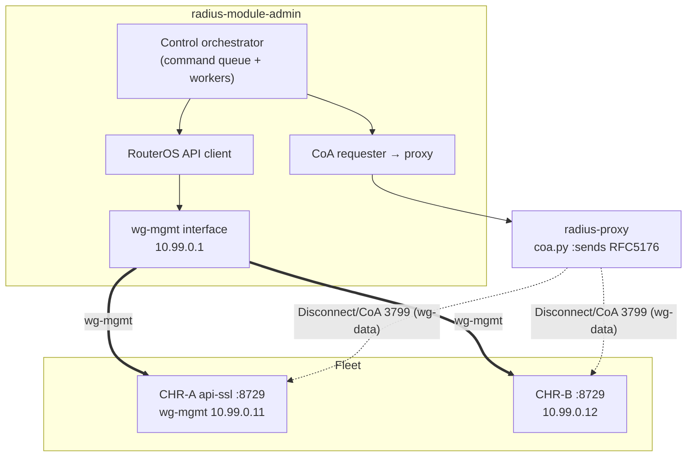
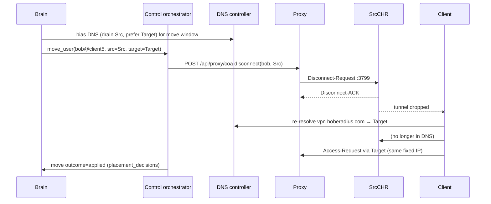

# 07 — Control Plane (Panel ↔ CHR over WireGuard)

> The real-time command + telemetry channel between the maestro and each CHR.
> Runs over the `wg-mgmt` WireGuard tunnel. Carries commands (query CPU/sessions,
> disconnect/move a user, push config) and telemetry — **never** customer data.

---

## 7.1 Topology



Two distinct command rails:

1. **RouterOS API over `wg-mgmt`** — reads (CPU, sessions, bytes) and writes
   (push config, enable/disable, kick a local PPP session). Panel → CHR directly.
2. **RADIUS CoA via the proxy** — kill-old/move a session by `Acct-Session-Id`
   (RFC 5176). Panel → proxy → CHR's 3799. Used because the proxy holds the CHR
   secret and the session truth ([04](04_FIXED_IP_AND_SESSIONS.md)).

---

## 7.2 Why WireGuard for control

| Property | Benefit |
|---|---|
| Encrypted + authenticated by keypair | RouterOS API/secrets never traverse the public internet in clear. |
| NAT-traversing, roaming endpoints | CHRs behind provider NAT still reachable; `persistent-keepalive` holds the path. |
| Cheap on RouterOS 7.x (kernel WG) | Negligible CPU vs the data tunnels. |
| Already an invariant | Current deployment doc mandates `wg-mgmt` with no data route — we reuse it. |

**Hard invariant (carried + enforced by onboarding):** `wg-mgmt` has **no default
route, no NAT, no forwarding**. It is a pure control channel. Verified in the
onboarding `verifying` step ([06](06_ONBOARDING_WIZARD.md) §6.7).

---

## 7.3 Command catalog

| Command | Rail | RouterOS / RADIUS primitive | Used by |
|---|---|---|---|
| `get_metrics` | API | `/system/resource` (CPU/mem), `/ppp/active/print count`, `/interface/monitor-traffic` | health + brain ([05](05_LOAD_BALANCER_BRAIN.md)) |
| `list_sessions` | API | `/ppp/active/print`, `/ip/ipsec/active-peers` | session reconciliation |
| `disconnect_user` | CoA (preferred) / API fallback | RFC 5176 Disconnect-Request by `Acct-Session-Id`; fallback `/ppp/active/remove` | kill-old, evacuate ([04](04_FIXED_IP_AND_SESSIONS.md)) |
| `move_user` | CoA + DNS bias | disconnect on source; client redials front door (DNS prefers target) | rebalance/failover |
| `push_config` | API | run rendered RouterOS commands | onboarding/repair ([06](06_ONBOARDING_WIZARD.md)) |
| `set_enabled` / `drain` | API + DB | toggle servers / stop new sessions | maintenance |
| `health_probe` | API + ICMP | ping + api handshake | health loop ([03](03_FRONT_DOOR_DNS.md)) |

---

## 7.4 API contracts (internal panel services)

These are panel-internal HTTP services fronting the orchestrator (so the UI and
the brain call the same surface). All require the panel's internal auth.

### `GET /api/fleet/chr/{id}/metrics`
```json
{ "ok": true, "chr_id": 11, "ts": 1733740800,
  "cpu_pct": 41.2, "mem_pct": 38.0, "active_sessions": 213,
  "rx_bytes": 90230012, "tx_bytes": 120553311, "uptime_s": 408120 }
```

### `POST /api/fleet/chr/{id}/command`
```json
// request
{ "command": "disconnect_user",
  "args": { "username":"bob@client5", "acct_session_id":"8f2c..." },
  "reason": "kill_old_session", "idempotency_key": "ks-8f2c..." }
// response
{ "ok": true, "rail": "coa", "result": "disconnect_ack", "latency_ms": 740 }
```

### `POST /api/proxy/coa` (panel → proxy, see [01](01_ARCHITECTURE.md) §1.4.2)
```json
{ "action":"disconnect", "realm":"client5",
  "acct_session_id":"8f2c...", "username":"bob@client5",
  "chr_public_ip":"203.0.113.11", "idempotency_key":"ks-8f2c..." }
```
Proxy responds `{ "ok": true, "code": 41 }` (Disconnect-ACK) / `{ "ok": false, "code": 42 }` (NAK) / timeout.

All commands are **idempotent** via `idempotency_key`; replays return the original
result (critical for at-least-once delivery over flaky control links).

---

## 7.5 Security & auth model

| Layer | Mechanism |
|---|---|
| Transport | WireGuard (mutual keypair auth) on `wg-mgmt`; CoA inside `wg-data`. |
| RouterOS API | `api-ssl` (8729) only, bound to the `wg-mgmt` address, dedicated least-privilege RouterOS user per panel (not `admin`); password vault-stored. |
| Panel→proxy `/api/proxy/coa` | Same `X-Proxy-Token` HMAC scheme already used by the proxy (`routing_table.py:_make_token`) — reused, not reinvented. |
| CoA packet auth | Signed with `CHR_SHARED_SECRET`; RouterOS `/radius incoming accept=yes` only honors correctly-signed requests. |
| Key rotation | Onboarding stores keys by vault reference; rotation = re-render `wg-mgmt` peer + push (P10 hardening). |
| Blast radius | A compromised `wg-mgmt` key reaches one CHR's control only; cannot read customer RADIUS secrets (held only by proxy/panel) nor reach data tunnels. |

**Replay protection:** the `X-Proxy-Token` (`ts:nonce:HMAC`) must be validated
panel-side with a ±300 s window + nonce cache — recommended hardening also for the
existing endpoints (noted in [09](09_OWNER_INPUTS_AND_RISKS.md)).

---

## 7.6 Reliability of the control plane

| Concern | Design |
|---|---|
| CHR unreachable on `wg-mgmt` | Command queued + retried with backoff; after `CTRL_DOWN_AFTER` consecutive failures the node is also marked control-degraded (distinct from ICMP DOWN). |
| Command storms (mass failover) | Orchestrator worker pool with concurrency cap + per-CHR serialization; CoA batch capped (`MOVE_BATCH`, [05](05_LOAD_BALANCER_BRAIN.md)). |
| Partial apply of `push_config` | Scripts are idempotent; a failed push leaves node in `onboarding_jobs.status='failed'`, never half-in DNS. |
| Stale metrics | Each metric carries `ts`; the brain ignores samples older than `2 × SCORE_INTERVAL` and treats absence as control-degraded. |
| Clock skew | HMAC token window tolerant to ±300 s; metrics use panel receipt time as fallback. |

---

## 7.7 Sequence: a live "move user" (rebalance)



The "move" is a controlled disconnect + DNS-biased reconnect — the only
physically possible mechanism for stateful tunnels (see [04](04_FIXED_IP_AND_SESSIONS.md) §4.5).
