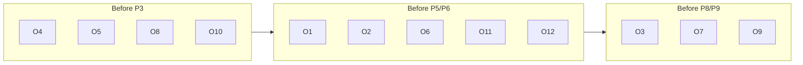

# 09 — Owner Inputs & Risks

> Everything that depends on the **owner's external resources** (accounts, API
> keys, real hardware) and the **honest risks/limits** of the design. Nothing
> here can be solved by code alone — these are the dependencies and the truths.

---

## 9.1 Owner-provided resources (blocking dependencies)

| # | Resource | Needed for | Phase blocked |
|---|---|---|---|
| O1 | **DNS API access for `hoberadius.com`** — delegate `vpn.hoberadius.com` to Cloudflare (recommended) / Route53 / self-hosted PowerDNS, plus a **zone-scoped API token** with DNS:Edit. | Front door. | P6 |
| O2 | **CHR hosting accounts** at ≥2 providers, each labeled open/unlimited or metered with real caps + $/TB. | Multi-provider fleet + cost scoring. | P3, P5 |
| O3 | **≥3 real CHRs across ≥2 providers** for failover/chaos testing (can't validate failover on one box). | P8/P10 chaos tests. | P8, P10 |
| O4 | **One-time RouterOS management reachability** per CHR (API/SSH on the provider's default mgmt address) to bootstrap `wg-mgmt`. | Onboarding first push. | P3 |
| O5 | **WireGuard endpoints for panel + proxy** (stable public IP/hostname + ports 51820/51821) so CHRs can dial home. | Control + data tunnels. | P3, P4, P7 |
| O6 | **TLS certificate for `vpn.hoberadius.com`** (wildcard or SAN), installable on every CHR, for SSTP (443) and IKEv2. | SSTP/IPsec front door. | P3, P6 |
| O7 | **Messaging gateway credentials** — SMS provider (e.g. Twilio), WhatsApp Business API, Telegram bot token + owner chat ID. | Notifications. | P9 |
| O8 | **Secrets vault** (or agreed storage) for WG private keys, RADIUS secrets, provider/DNS tokens. | All secret handling. | P2+ |
| O9 | **Per-customer agreement on `movable`** — which customers' users may be load-balanced in normal operation. | Rebalance policy. | P8 |
| O10 | **Fixed-IP plan sign-off** — the per-customer private supernet (`CLIENT_SUPERNET`) and per-user IP allocation owned by `radius-module`. | Fixed IP. | P2 |
| O11 | **Provider bandwidth-usage source** — provider API or SNMP for ground-truth metered usage (else we rely on interface counters only). | Cost accuracy. | P5 |
| O12 | **Decision on `DOWN_AFTER`** — accept the ~5 min agreed window, or trade toward ~90 s for faster failover at higher false-positive risk. | Health tuning. | P4 |

---

## 9.2 Honest physical limits (must stay in the design, not hidden)

### L1 — A CHR dying mid-session DROPS its live tunnels
PPTP/SSTP/IPsec are **stateful**: the session keys, sequence state, and NAT
mappings live on that one CHR. They **cannot teleport** to another host. When a
CHR dies:

- Its live tunnels drop. Full stop.
- The **best achievable** is automatic, fast **reconnect** (seconds) to the **same
  fixed IP** via the front door — **near-transparent, NOT zero-interruption.**
- Long-lived TCP flows inside the tunnel may reset; the user's apps reconnect.

> This is a property of VPN protocols, not a HobeRadius limitation. Marketing must
> say "automatic fast failover / near-transparent roaming", never "zero downtime".

### L2 — DNS failover is bounded by TTL + resolver behavior
Real failover time ≈ `DOWN_AFTER` + DNS propagation (≤ TTL, but some resolvers
ignore low TTLs) + client reconnect. With TTL 30 s and `DOWN_AFTER` ~5 min, plan
for **minutes**, not milliseconds, for the *detection*; the reconnect itself is
seconds once DNS updates. Lowering `DOWN_AFTER` helps detection but risks flapping
(L3).

### L3 — Flapping
A half-dead CHR (intermittent ping) could oscillate in/out of DNS. Mitigated by
hysteresis + cooldown + `FLAP_DAMPEN` ([05](05_LOAD_BALANCER_BRAIN.md) §5.5), but the
trade-off is real: more damping = slower recovery of a genuinely-healed node.

### L4 — Thundering herd on mass failover
When a big CHR (or a whole provider) dies, all its users reconnect at once. If the
remaining fleet lacks headroom, targets can cascade. Mitigated by the
capacity-headroom guard (proactive alert), top-N DNS spread, and staggered
reconnect ([05](05_LOAD_BALANCER_BRAIN.md) §5.6.3) — but **the owner must keep spare
capacity**; software can warn, not conjure servers (unless O2 auto-provision is
wired).

### L5 — Brief double-presence of a fixed IP during reconnect
For the seconds between a new session coming up and the old one being CoA-reaped,
a fixed IP may momentarily exist in two `sessions` rows. The DB unique indexes +
"new wins" + CoA resolve it within seconds ([04](04_FIXED_IP_AND_SESSIONS.md) §4.4.2);
return-path correctness is only guaranteed once the old session closes. This is a
known, bounded window — not a steady-state duplicate.

### L6 — Move = disconnect + reconnect, not live migration
Every "move" (rebalance or failover) is a controlled disconnect + DNS-biased
reconnect. The user sees a brief reconnect. There is no live tunnel handoff. (Same
root cause as L1.)

### L7 — Accounting gaps degrade scoring accuracy
The cost/usage scoring is only as good as the bandwidth data. Lost Acct packets
(UDP) or counter resets ([05](05_LOAD_BALANCER_BRAIN.md) §5.3) introduce error; provider
API ground-truth (O11) is the antidote. Without it, metered-cap decisions are
estimates.

---

## 9.3 Security risks & mitigations

| Risk | Mitigation | Owner action |
|---|---|---|
| Single shared `CHR_SHARED_SECRET` fleet-wide (current MVP, `config.py:89`) | Per-CHR secret option in P10-T2; rotate regularly | Approve per-CHR secrets in hardening |
| `X-Proxy-Token` replay | Nonce cache + ±300 s window (P10-T1) | none (code) |
| Compromised `wg-mgmt` key | Blast radius = one CHR's control only; no customer secrets exposed; rotation (P10-T3) | Rotate keys per policy |
| DNS token over-scope | Use a **zone-scoped, DNS-only** token, not a global API key | Provision scoped token (O1) |
| RouterOS API exposure | `api-ssl` bound to `wg-mgmt` only, least-priv user, never `admin` | Confirm provider firewall |
| Secrets in DB | Vault references only; no plaintext keys/secrets columns ([02](02_DATA_MODEL.md) §2.10) | Provide vault (O8) |
| Public RADIUS/CoA exposure | Ports 1812/1813/3799 only on WireGuard; onboarding firewall drops public ([06](06_ONBOARDING_WIZARD.md) §6.5) | none (template) |

---

## 9.4 Operational risks

| Risk | Impact | Mitigation |
|---|---|---|
| Panel outage | No new placement/rebalance/failover decisions | Data plane keeps serving last-good state + DNS last-published; design is fail-safe ([01](01_ARCHITECTURE.md) §1.1); make panel HA in P10 |
| DNS provider outage | Front door can't be updated | Last record set stays live; multi-provider DNS option (P6-T5); CRIT alert |
| Customer RADIUS down | No auth → no IP → no connection (by design, no local pool) | Per-realm health surfaced; this is the customer's responsibility, documented |
| Clock skew on CHRs | Token/CoA auth issues | NTP in onboarding template; ±300 s tolerance |
| Over-aggressive rebalance | User churn | Conservative margins/batch caps ([05](05_LOAD_BALANCER_BRAIN.md) §5.6.1); `movable` opt-in |

---

## 9.5 Pre-launch owner checklist

- [ ] DNS delegated + scoped token issued (O1)
- [ ] ≥2 provider accounts, cost models recorded (O2)
- [ ] ≥3 CHRs across ≥2 providers for chaos testing (O3)
- [ ] Panel + proxy WireGuard endpoints reachable (O5)
- [ ] `vpn.hoberadius.com` TLS cert ready for all CHRs (O6)
- [ ] Messaging gateways configured + owner contact set (O7)
- [ ] Secrets vault available (O8)
- [ ] `movable` policy agreed per customer (O9)
- [ ] Fixed-IP supernet + allocation signed off (O10)
- [ ] Provider usage API/SNMP for metered billing (O11)
- [ ] `DOWN_AFTER` value chosen (~5 min vs ~90 s) (O12)
- [ ] Accepted limits L1–L7 communicated to customers (no "zero downtime" claims)

---

## 9.6 Recommended phasing of owner inputs

Securing O3 (real multi-provider CHRs) early is wise even though it's "late" —
provisioning real boxes has the longest lead time and gates the most valuable
test (chaos failover).
